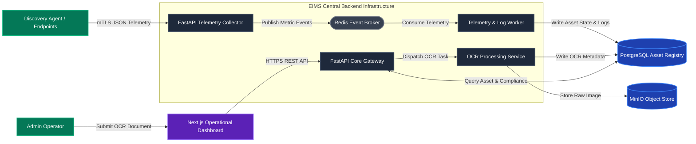

# EIMS Master Plan

| Metadata | Value |
| :--- | :--- |
| **Document ID** | EIMS-MP-001 |
| **Version** | 1.0.0 |
| **Status** | Approved |
| **Owner** | Lead Software Architect |
| **Last Updated** | 2026-08-04 |
| **Review Cycle** | Annual |
| **Related Documents** | [Handbook Home](docs/index.md), [PRD](02_PRODUCT_REQUIREMENTS_DOCUMENT.md), [Architecture](03_SOFTWARE_ARCHITECTURE_DOCUMENT.md) |

---

## 1. Purpose

This document defines the overarching technical vision, strategic structural objectives, architectural boundaries, and developmental roadmap for the Enterprise Infrastructure Management System (EIMS). As Core Law 1 of the platform, this Master Plan governs long-term engineering evolution and establishes the foundational requirements from which all downstream software architecture, database design, API specifications, and codebase implementations must derive.

---

## 2. Scope

This plan encompasses the complete functional and operational domain of the EIMS enterprise software lifecycle:
- Automated hardware detection and diagnostics via distributed Discovery Agents.
- Centralized Asset Registry infrastructure supporting high-frequency ingestion.
- Optical Character Recognition (OCR Asset Registration) pipelines for physical hardware ingestion.
- Detailed internal Hardware Inventory cataloging and tracking.
- Continuous ingestion and operational processing of Windows Log Analysis streams.
- Automated security evaluation algorithms calculating real-time Compliance Scores.
- Observability and management visualization through the Next.js Operational Dashboard.

**Out of Scope:** Direct physical datacenter environmental facilities control (HVAC/PDU electrical actuation) and primary corporate directory infrastructure management (raw Active Directory domain controller replacement) remain strictly external to EIMS.

---

## 3. Audience

This document targets Senior Software Architects, Lead System Engineers, Backend and Frontend Software Developers, DevOps Specialists, Quality Assurance Engineers, and Technical Reviewers responsible for architecting, reviewing, building, and maintaining the EIMS product ecosystem.

---

## 4. Table of Contents

- [1. Purpose](#1-purpose)
- [2. Scope](#2-scope)
- [3. Audience](#3-audience)
- [4. Table of Contents](#4-table-of-contents)
- [5. Architecture & Technical Strategy](#5-architecture-technical-strategy)
  - [5.1 Platform Problem Statement & Core Capabilities](#51-platform-problem-statement-core-capabilities)
  - [5.2 Technology Stack Selection & Engineering Rationale](#52-technology-stack-selection-engineering-rationale)
  - [5.3 Structural Platform Architecture](#53-structural-platform-architecture)
- [6. System Evolution & Roadmap](#6-operational-procedures)
- [7. References](#7-references)
- [8. Related Documents](#8-related-documents)
- [9. Revision History](#9-revision-history)

---

## 5. Architecture & Technical Strategy

### 5.1 Platform Problem Statement & Core Capabilities

Enterprise IT infrastructures operate across fragmented networking boundaries, leading to decentralized inventory records, undocumented physical server additions, delayed configuration vulnerabilities, and unmonitored event log sprawl. EIMS resolves this architectural fragmentation by unifying hardware registry, telemetry collection, and compliance monitoring under five centralized engineering pillars:

1. **Autonomous Infrastructure Discovery:** Distributed lightweight *Discovery Agents* deploy across networked operating systems and compute nodes to poll system metrics, enumerate hardware topology, and stream diagnostic payloads to the core *Telemetry Collector*.
2. **Automated Lifecycle Asset Registry:** The core engine maintains an immutable historical database of every *Infrastructure Asset*, augmented by an intelligent *OCR Asset Registration* pipeline capable of converting hardware purchase documentation, shipping barcodes, and chassis specifications directly into relational database entities.
3. **Hardware & Configuration Inventory:** A dedicated component catalog records deep *Hardware Inventory* architectures (CPU SKU allocations, memory DIMM serial metrics, storage array controller states) attached to each registered *Endpoint*.
4. **Real-Time Windows Event Log Analytics:** A high-throughput processing pipeline executes *Windows Log Analysis* by ingesting continuous native `.evtx` streaming metrics, extracting indicators of compromise (IoCs), and indexing authentication anomalies.
5. **Continuous Security & Compliance Auditing:** Algorithmic evaluation engines compare operational configuration state against required enterprise hardening baselines to compute a standardized dynamic *Compliance Score* (0–100), logging all structural transitions within an immutable *Audit Log*.

### 5.2 Technology Stack Selection & Engineering Rationale

EIMS enforces a strict high-performance industry-standard production technology stack. The table below outlines our approved engineering dependencies and justifies the structural trade-offs supporting each decision.

| Layer / Functional Role | Chosen Technology Stack | Engineering Rationale & Architectural Trade-offs |
| :--- | :--- | :--- |
| **Backend & Ingestion Gateway** | **FastAPI** (Python 3.12+) | Selected for high-performance native asynchronous execution (ASGI), automatic data validation via Pydantic, and self-documenting OpenAPI contract generation. *Trade-off:* Relinquishes heavy multi-threaded CPU computational raw speed (versus Go/Rust) in favor of rapid ecosystem integration and native OCR/machine-learning library interoperability. |
| **Frontend & User Interface** | **Next.js** with **React** and **TypeScript** | Delivers optimal server-side rendering (SSR), explicit static static typing guarantees, and responsive enterprise dashboard visualization. *Trade-off:* Requires managing Node.js server runtime layers alongside static React DOM rendering bundles. |
| **Relational Database Engine** | **PostgreSQL** | Provides ACID transaction integrity, advanced JSONB indexing for polymorphic telemetry payloads, and enterprise relational partitioning. *Trade-off:* Requires dedicated connection pooling architectures (PgBouncer) to sustain thousands of concurrent telemetry connections compared to schema-less document datastores. |
| **In-Memory Cache & Message Broker** | **Redis** | Operates as an ultra-low-latency distributed cache for active session authentication tokens, rate limiting quotas, and transient telemetry queue buffers. *Trade-off:* Memory storage constraints necessitate strict eviction policies (Volatile-LRU) and persistence fallback synchronization (AOF/RDB). |
| **Object Storage Engine** | **MinIO** | Implements high-performance S3-compatible enterprise object storage locally for saving OCR shipping imagery, raw firmware backups, and archived Windows event logs. *Trade-off:* Requires independent disk volume provisioning and bucket lifecycle policies to manage high-volume data growth. |
| **Container Infrastructure & Orchestration** | **Docker** and **Docker Compose** | Enforces immutable execution environments across development, integration testing, and staging releases, guaranteeing parity between engineering workstations and production deployments. *Trade-off:* Introduces virtualized network bridge overhead compared to native bare-metal binary execution. |
| **CI/CD Automation Pipeline** | **GitHub Actions** | Provides native version control pipeline integrations enforcing automated linting, security scanning, architectural schema validation, and unit test execution prior to code merge. |
| **Telemetry Observability Suite** | **Prometheus**, **Grafana**, and **Loki** | Delivers enterprise metrics scraping (Prometheus), structured real-time application log indexing (Loki), and centralized diagnostic visualization graphs (Grafana). *Trade-off:* Allocates systemic compute and memory resources solely for operational observability overhead. |

### 5.3 Structural Platform Architecture

The structural architecture follows an asynchronous ingestion pipeline design paired with synchronous REST/OpenAPI operational management boundaries.

---

## 6. System Evolution & Roadmap

EIMS development executes through progressive engineering phases. Each phase establishes immutable architectural milestones enforced by automated testing and peer code review.

| Sprint / Milestone | Engineering Focus Area | Mandatory Deliverables & Verification Criteria |
| :--- | :--- | :--- |
| **Sprint 0 (Completed)** | **EIMS Documentation System (EDS)** | Canonical documentation architecture, vocabulary templates, writing rules, and MkDocs static generation pipeline established and frozen at Version 1.0.0. |
| **Sprint 1 (Active)** | **Platform Core Laws & Architectural Specifications** | Authoritative Master Plan (`01_`), Product Requirements Document (`02_`), Software Architecture Document (`03_`), Database Design (`04_`), and OpenAPI Specification (`05_`) written and verified against EDS v1.0.0. |
| **Sprint 2** | **Backend Foundation & Core Asset Registry** | FastAPI modular server scaffolding, PostgreSQL Docker containers, SQLAlchemy/Pydantic domain models, database migration engines (Alembic), and baseline CRUD interfaces for *Infrastructure Asset* records. |
| **Sprint 3** | **Telemetry Collector & Discovery Agent Ingestion** | Lightweight Discovery Agent communication protocol, asynchronous FastAPI ingestion endpoints, Redis telemetry message buffering, and robust background worker processing pipelines. |
| **Sprint 4** | **MinIO Integration & OCR Asset Registration** | MinIO S3 object storage configurations, multipart document ingestion APIs, optical character recognition background parsing workers, and automated hardware manifest-to-database registration logic. |
| **Sprint 5** | **Windows Log Analytics & Compliance Score Engines** | High-throughput Windows event log (`.evtx`) parser, automated IoC pattern matching algorithms, continuous rules-based *Compliance Score* recalculation engines, and immutable *Audit Log* persistence. |
| **Sprint 6** | **Operational Dashboard & Enterprise Observability** | Next.js server-side React application integration, real-time WebSocket dashboard metrics, RBAC user authentication interfaces, and production Prometheus + Grafana + Loki monitoring integration. |
| **Sprint 7+** | **High Availability & Enterprise Scale Production Clustering** | PostgreSQL Read-Replica scaling, Redis Sentinel clustering, multi-node Kubernetes container deployments, disaster recovery failover automation, and comprehensive security penetration benchmarking. |

---

## 7. References

- [NIST Cybersecurity Framework (CSF) Version 2.0 - Asset Management & Enterprise Risk](https://www.nist.gov/cyberframework)
- [CIS Critical Security Controls - Control 1: Inventory and Control of Enterprise Assets](https://www.cisecurity.org/controls/inventory-and-control-of-enterprise-assets)
- [PostgreSQL Enterprise High Availability and Partitioning Documentation](https://www.postgresql.org/docs/current/ddl-partitioning.html)
- [FastAPI High Performance Asynchronous Python Architecture Whitepapers](https://fastapi.tiangolo.com/async/)

---

## 8. Related Documents

- [EIMS Product Requirements Document](02_PRODUCT_REQUIREMENTS_DOCUMENT.md)
- [EIMS Software Architecture Document](03_SOFTWARE_ARCHITECTURE_DOCUMENT.md)
- [EIMS Database Design Specification](04_DATABASE_DESIGN.md)
- [EIMS OpenAPI Specification](05_API_SPECIFICATION.md)
- [EDS Document Standards and Terminology](docs/_style/document-standard.md)

---

## 9. Revision History

| Version | Date | Author | Status | Description of Change |
| :--- | :--- | :--- | :--- | :--- |
| 1.0.0 | 2026-08-04 | Lead Software Architect | Approved | Initial canonical release of Core Law 1: Platform Master Plan under frozen EDS v1.0.0 guidelines. |
