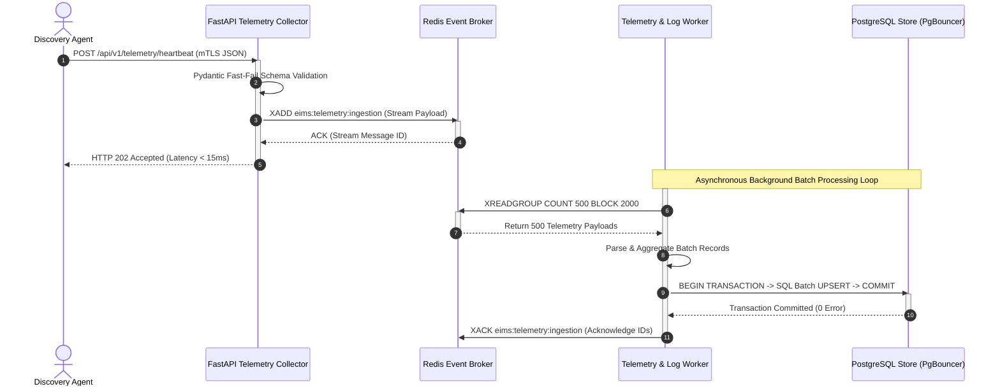
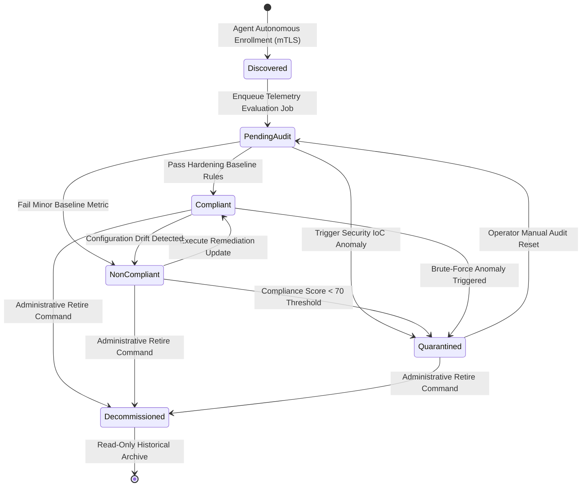

# EIMS Software Architecture Document

| Metadata | Value |
| :--- | :--- |
| **Document ID** | EIMS-SAD-001 |
| **Version** | 1.0.0 |
| **Status** | Approved |
| **Owner** | Lead Software Architect |
| **Last Updated** | 2026-08-04 |
| **Review Cycle** | Annual |
| **Related Documents** | [Master Plan](01_EIMS_MASTER_PLAN.md), [PRD](02_PRODUCT_REQUIREMENTS_DOCUMENT.md), [Database Design](04_DATABASE_DESIGN.md) |

---

## 1. Purpose

This document serves as the single authoritative source of truth for the systemic software architecture of the Enterprise Infrastructure Management System (EIMS). As Core Law 3 of the platform, this specification articulates module boundary decouplings, inter-process communication protocols, event-driven diagnostic telemetry pipelines, fault-isolation patterns, database connection pooling strategies, and structural state transition models. All subsequent codebase implementations, backend routing layers, and infrastructure deployment compositions must adhere directly to the architectural parameters defined herein.

---

## 2. Scope

This document governs all computational execution layers within the EIMS platform ecosystem:
- Backend ingestion frameworks and management gateways running on FastAPI.
- Frontend web applications built using Next.js, React, and TypeScript.
- Relational persistence engines and transactional connection layers utilizing PostgreSQL and PgBouncer.
- High-throughput message routing and caching tiers running on Redis.
- Localized unstructured binary object persistence managed by MinIO S3 storage buckets.
- Network interface integrations binding remote *Discovery Agent* endpoints to central telemetry ingestion infrastructures.

---

## 3. Audience

This specification is authored for Senior Software Architects, Lead System Engineers, Backend and Frontend Software Developers, Database Engineering Specialists, DevOps Container Engineers, and Quality Security Reviewers tasked with developing, verifying, or auditing runtime infrastructure modules against established engineering designs.

---

## 4. Table of Contents

- [1. Purpose](#1-purpose)
- [2. Scope](#2-scope)
- [3. Audience](#3-audience)
- [4. Table of Contents](#4-table-of-contents)
- [5. Architectural Style & Core Patterns](#5-architectural-style-core-patterns)
  - [5.1 Hybrid Modular Monolith & Event-Driven Ingestion](#51-hybrid-modular-monolith-event-driven-ingestion)
  - [5.2 C4 Container Architecture & Boundary Allocation](#52-c4-container-architecture-boundary-allocation)
- [6. Subsystem Architectural Deep Dives](#6-subsystem-architectural-deep-dives)
  - [6.1 Asynchronous Telemetry Ingestion Pipeline](#61-asynchronous-telemetry-ingestion-pipeline)
  - [6.2 Non-Blocking OCR Asset Registration Pipeline](#62-non-blocking-ocr-asset-registration-pipeline)
  - [6.3 Windows Log Analysis & Real-Time Anomaly Engine](#63-windows-log-analysis-real-time-anomaly-engine)
  - [6.4 Canonical Asset Lifecycle State Machine](#64-canonical-asset-lifecycle-state-machine)
- [7. Cross-Cutting Engineering Concerns](#7-cross-cutting-engineering-concerns)
  - [7.1 Authentication & Authorization Architecture](#71-authentication-authorization-architecture)
  - [7.2 Database Connection Pooling & Resilience](#72-database-connection-pooling-resilience)
  - [7.3 Fault Isolation & Dead Letter Queue (DLQ) Strategy](#73-fault-isolation-dead-letter-queue-dlq-strategy)
- [8. References](#8-references)
- [9. Related Documents](#9-related-documents)
- [10. Revision History](#10-revision-history)

---

## 5. Architectural Style & Core Patterns

### 5.1 Hybrid Modular Monolith & Event-Driven Ingestion

EIMS implements a **Hybrid Modular Monolith paired with an Asynchronous Event-Driven Ingestion Architecture**. Rather than separating primary administrative domain functionality into heavily fragmented microservices that increase networking failure domains and operational overhead, core application logic resides within unified, modular FastAPI processes deployed across stateless container replicas. Conversely, high-frequency diagnostic data streams—such as metric heartbeats from remote *Discovery Agents* and event strings from *Windows Log Analysis*—bypass synchronous database execution paths entirely, routing through distributed asynchronous event queues.

**Architectural Rationale & Trade-off Analysis:**
- **Why a Modular Monolith over Pure Microservices?** A unified FastAPI domain server enforces compile-time type validation across operational models, minimizes inter-container serialization latencies, and simplifies transactional boundary consistency across relational database tables. *Trade-off:* Requires disciplined directory structures (`backend/domain/...`) and rigorous code reviews to prevent tight functional coupling between disparate business domains within the same application process space.
- **Why Event-Driven Ingestion?** Direct synchronous database writes cannot sustain burst ingestion traffic totaling thousands of incoming diagnostic payloads per second without saturating relational disk I/O channels. By decoupling payload reception from database persistence via an in-memory Redis event broker, the *Telemetry Collector* returns instant HTTP 202 acknowledgment responses, protecting PostgreSQL from throughput exhaustion during widespread enterprise network reconnections.

### 5.2 C4 Container Architecture & Boundary Allocation

The table below delineates functional runtime modules and their allocated container boundaries, followed by our standard C4 architectural layout representation.

| Module / Container Name | Runtime Technology Stack | Architectural Responsibility | Primary Communication Protocols |
| :--- | :--- | :--- | :--- |
| **Operational Dashboard** | Next.js + React + TypeScript | Server-side web UI rendering, real-time metrics charting, and interactive administrative configurations. | HTTPS / REST, Secure WebSockets (WSS) |
| **FastAPI Core Gateway** | FastAPI (Python Asynchronous ASGI) | REST API contract orchestration, RBAC JWT token verification, synchronous *Asset Registry* queries, and WebSocket streaming. | HTTPS / JSON REST, WSS |
| **Telemetry Collector** | FastAPI (Dedicated Lightweight Workers) | High-throughput edge ingestion endpoint for remote agents, schema deserialization, and instant Redis queue payload enqueuing. | mTLS HTTPS / JSON, Redis RESP Protocol |
| **Telemetry & Log Worker** | Python Async Background Processors | Continuous Redis stream consumer executing batch PostgreSQL relational upserts, baseline evaluations, and anomaly alerting. | Redis RESP Protocol, SQL via PgBouncer |
| **OCR Extraction Worker** | Python + OpenCV + Tesseract / AI Engine | Autonomous polling worker capturing multipart imagery from MinIO, executing OCR string extraction, and mapping hardware serials. | MinIO HTTP S3 API, SQL via PgBouncer |
| **Redis Event Broker** | Redis In-Memory Datastore | Transient in-memory queue buffering for incoming diagnostic payloads and sub-millisecond JWT blacklist authentication lookups. | Redis RESP Protocol (In-Memory TCP) |
| **PostgreSQL Asset Registry** | PostgreSQL Database Engine | Persistent ACID datastore for canonical asset models, historical metrics, inventory mappings, and append-only *Audit Log* tables. | TCP Wire Protocol via PgBouncer |
| **MinIO Object Store** | MinIO Storage Container | High-performance local S3-compatible binary object archival for shipping invoices, hardware imagery, and diagnostic dumps. | HTTP / REST S3 Compatible API |

```mermaid
flowchart LR
    classDef service fill:#1E293B,stroke:#475569,color:#FFFFFF,stroke-width:2px;
    classDef store fill:#1E40AF,stroke:#3B82F6,color:#FFFFFF,stroke-width:2px;
    classDef agent fill:#047857,stroke:#10B981,color:#FFFFFF,stroke-width:2px;
    classDef ui fill:#5B21B6,stroke:#8B5CF6,color:#FFFFFF,stroke-width:2px;
    classDef queue fill:#374151,stroke:#6B7280,color:#FFFFFF,stroke-width:2px;

    Agent[Discovery Agent] ::: agent -->|mTLS HTTPS Payload| Collector[FastAPI Telemetry Collector] ::: service
    Admin[Operator / Auditor] ::: agent -->|HTTPS & WebSockets| UI[Next.js Operational Dashboard] ::: ui
    UI -->|REST / OpenAPI| API[FastAPI Core Gateway] ::: service
    UI <-->|WSS Alert Feed| API

    subgraph EIMS Asynchronous Processing Architecture
        Collector -->|LPUSH Telemetry Stream| Broker([Redis Event Broker]) ::: queue
        Broker -->|BRPOP / Consume Queue| Processor[Telemetry & Log Worker] ::: service
        API -->|Upload Image Binary| S3[(MinIO Object Store)] ::: store
        API -->|LPUSH OCR Job ID| Broker
        Broker -->|Consume OCR Task| OCR[OCR Extraction Worker] ::: service
        OCR <-->|Fetch Image Binary| S3
    end

    Processor -->|Batch SQL Upsert| Pool[PgBouncer Connection Pool] ::: service
    OCR -->|Write Inventory Metrics| Pool
    API <-->|Transactional Read/Write| Pool
    Pool <-->|Persistent TCP Trunk| DB[(PostgreSQL Asset Registry)] ::: store
```

---

## 6. Subsystem Architectural Deep Dives

### 6.1 Asynchronous Telemetry Ingestion Pipeline

To satisfy our non-functional throughput target (`NFR-PERF-02`, requiring 5,000 requests per second with HTTP 202 acknowledgment latencies beneath 15 milliseconds), the *Telemetry Collector* bypasses direct synchronous database interactions entirely. 

**Ingestion Execution Protocol:**
1. **Edge Authentication:** The *Discovery Agent* opens an mTLS connection; the reverse proxy validates client certificates before forward routing.
2. **Schema Deserialization:** The FastAPI collector receives the payload string, performing sub-millisecond zero-copy Pydantic schema validation.
3. **Queue Enqueuing:** Upon successful validation, the service appends the payload binary directly to a bounded Redis stream (`eims:telemetry:ingestion`) via atomic Redis commands and instantly responds with HTTP status `202 Accepted`.
4. **Batch Relational Processing:** Dedicated asynchronous worker daemons consume payload chunks in batches of 500 records using blocking queue pops (`XREADGROUP`). Workers execute SQL `INSERT ... ON CONFLICT DO UPDATE` commands to aggregate diagnostic updates within a single ACID transaction, multiplying effective datastore throughput by orders of magnitude.



### 6.2 Non-Blocking OCR Asset Registration Pipeline

The *OCR Asset Registration* capability converts physical shipping documents into canonical database objects without consuming web server execution threads during high-latency computer vision text extraction tasks.

**Execution Lifecycle:**
1. An administrator submits a hardware specification invoice (up to 25 MB) to the FastAPI Gateway via multipart upload.
2. The Gateway transfers the raw file binary directly to local MinIO storage using native asynchronous S3 client drivers, recording an unguessable object hash URI (e.g., `s3://eims-manifests/2026/sha256_file.pdf`).
3. The Gateway inserts a pending status entity inside the *Asset Registry* table, enqueues an asynchronous OCR execution job inside Redis (`eims:jobs:ocr`), and returns HTTP status `202 Accepted` alongside the preliminary asset tracking UUID.
4. The standalone OCR Worker process de-queues the job ID, fetches the image binary from MinIO, executes optical character parsing and part-number regular expression mapping, and updates the canonical *Hardware Inventory* database tables via PgBouncer.

### 6.3 Windows Log Analysis & Real-Time Anomaly Engine

The *Windows Log Analysis* pipeline processes uninterrupted streams of operating system event metrics while extracting security anomalies without introducing analytical latency.

**Sliding Window Anomaly Rule Engine:**
- As background telemetry workers extract Event ID strings from incoming agent streams, security-critical events (such as Event ID `4625 Failed Logon`) route through an in-memory Redis sliding-window algorithmic rate limiter.
- Each failed login authentication event executes a Redis atomic increment command keyed to the endpoint's source IP address (`eims:sec:bruteforce:{src_ip}`).
- If the increment count surpasses five failed occurrences within a rolling sixty-second expiration window, the rule engine immediately:
  1. Sets the target asset's status flag to `Quarantined`.
  2. Appends an immutable security violation entry to the PostgreSQL *Audit Log*.
  3. Publishes an asynchronous event payload over Redis Pub/Sub (`eims:events:alerts`), which FastAPI WebSocket gateways broadcast immediately to connected Next.js *Operational Dashboard* client sessions.

### 6.4 Canonical Asset Lifecycle State Machine

To preserve data fidelity and prevent operational conflicts (`REQ-REG-03`), all registered *Infrastructure Asset* records must adhere strictly to our defined state machine boundaries. Any attempt by automated scripts or operators to bypass adjacent transition arrows triggers automatic HTTP `409 Conflict` rejections and security logging events.



---

## 7. Cross-Cutting Engineering Concerns

### 7.1 Authentication & Authorization Architecture

EIMS isolates security enforcement using stateless cryptographic authentication protocols coupled with high-performance in-memory revocation mechanisms.
- **Operator Web Authentication:** Operators authenticate against FastAPI gateways using one-way Argon2id hashed password verification, receiving short-lived JSON Web Tokens (JWT, 15-minute expiry) paired with HTTP-only refresh tokens.
- **Revocation & Logout Protection:** When an operator executes a logout command or triggers administrative account suspension, the active JWT identifier (`jti`) writes to a distributed Redis revocation blacklist matching the token's remaining time-to-live (TTL). Every subsequent API request executes a sub-millisecond Redis verification check before executing business logic.
- **Role-Based Access Control (RBAC):** Every API endpoint binds to strict Pydantic authorization dependencies validating JWT role claims (`System Administrator`, `Security & Compliance Auditor`, `Hardware Field Technician`). Requests targeting unauthorized functional boundaries abort immediately with HTTP `403 Forbidden` responses.

### 7.2 Database Connection Pooling & Resilience

Direct connection architectures fail dramatically when deployment scale exceeds hundreds of simultaneous worker threads and agent ingestion streams. Each independent PostgreSQL connection allocates isolated memory overhead totaling ~10 megabytes, rapidly inducing kernel out-of-memory memory exhaustion at high scale.
- **PgBouncer Mandatory Layering:** All FastAPI application instances, Telemetry Workers, and OCR extraction daemons route SQL executions through an intermediate **PgBouncer** connection pooling tier configured in **Transaction Pooling Mode**. 
- **Architectural Impact:** Under transaction pooling, PgBouncer assigns physical PostgreSQL server connections exclusively during active transaction execution bursts (`BEGIN ... COMMIT`), immediately recycling network sockets back into the available pool upon completion. This enables 5,000 asynchronous worker daemons to operate efficiently over fewer than 100 actual backend relational database connections.

### 7.3 Fault Isolation & Dead Letter Queue (DLQ) Strategy

Distributed architectures must withstand partial downstream infrastructure failures without catastrophic global system crashes or permanent data degradation.
- **Worker Crash Resilience:** If an exception occurring within an asynchronous OCR extraction or telemetry parsing worker causes process termination prior to database commit acknowledgment (`XACK`), pending messages remain intact inside Redis stream Consumer groups. Automatic monitoring watchdogs reassign unacknowledged messages to surviving container replicas after a 30-second processing execution timeout.
- **Dead Letter Queue (DLQ) Fallback:** If malformed diagnostic payload schemas or database uniqueness constraint violations cause batch database updates to fail repeatedly, workers perform three sequential exponential back-off retry iterations (1s, 5s, 15s). If failure persists upon the third attempt, the offending payload segregates automatically into an isolated Redis **Dead Letter Queue** (`eims:telemetry:dlq`), logging a critical structural exception to Grafana observability dashboards without obstructing routine ingestion flow.

---

## 8. References

- [C4 Model for Software Application Architecture and Visual Abstraction](https://c4model.com/)
- [PostgreSQL Transaction Pooling Architecture via PgBouncer Specification](https://www.pgbouncer.org/architecture.html)
- [Redis Streams & Distributed Message Queue Architectural Whitepapers](https://redis.io/docs/data-types/streams/)
- [NIST SP 800-207 - Zero Trust Architecture Engineering Parameters](https://csrc.nist.gov/publications/detail/sp/800-207/final)

---

## 9. Related Documents

- [EIMS Master Plan Specification](01_EIMS_MASTER_PLAN.md)
- [EIMS Product Requirements Document](02_PRODUCT_REQUIREMENTS_DOCUMENT.md)
- [EIMS Database Design Specification](04_DATABASE_DESIGN.md)
- [EIMS OpenAPI Specification](05_API_SPECIFICATION.md)
- [EDS Document Standards and Terminology](docs/_style/document-standard.md)

---

## 10. Revision History

| Version | Date | Author | Status | Description of Change |
| :--- | :--- | :--- | :--- | :--- |
| 1.0.0 | 2026-08-04 | Lead Software Architect | Approved | Initial canonical release of Core Law 3: Software Architecture Document under frozen EDS v1.0.0 rules. |
