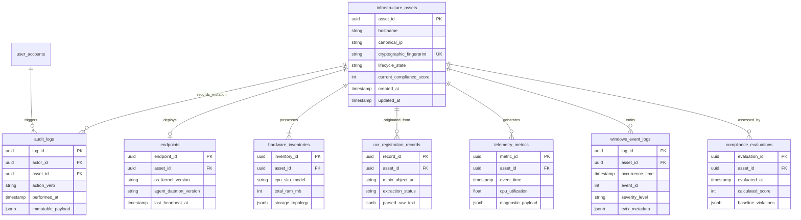

# EIMS Database Design Specification

| Metadata | Value |
| :--- | :--- |
| **Document ID** | EIMS-DBD-001 |
| **Version** | 1.0.0 |
| **Status** | Approved |
| **Owner** | Lead Software Architect |
| **Last Updated** | 2026-08-04 |
| **Review Cycle** | Annual |
| **Related Documents** | [Master Plan](01_EIMS_MASTER_PLAN.md), [PRD](02_PRODUCT_REQUIREMENTS_DOCUMENT.md), [SAD](03_SOFTWARE_ARCHITECTURE_DOCUMENT.md) |

---

## 1. Purpose

This document constitutes the canonical single source of truth for all persistence architectures, relational database schemas, Entity-Relationship (ER) structures, indexing strategies, time-series table partitioning rules, in-memory cache key schemas, and object storage linkage implementations across the Enterprise Infrastructure Management System (EIMS). As Core Law 4 of the platform, this specification governs every database migration, backend data modeling abstraction, and infrastructure query execution pattern.

---

## 2. Scope

This design encompasses every data persistence layer deployed within EIMS:
- Relational schema modeling and constraints across primary PostgreSQL databases.
- High-frequency stream queue topologies and authentication caching architectures in Redis.
- Localized unstructured S3 storage bucket schemas managed via MinIO.
- Automated declarative schema migration workflows governed via SQLAlchemy and Alembic.
- Cryptographic hashing and append-only database table immutability rules protecting audit trails.

---

## 3. Audience

This document targets Senior Software Architects, Lead System Engineers, Backend Software Developers, Database Engineering Specialists (DBAs), DevOps Platform Release Leads, and Security Compliance Auditors responsible for implementing, maintaining, testing, or auditing platform persistent data stores.

---

## 4. Table of Contents

- [1. Purpose](#1-purpose)
- [2. Scope](#2-scope)
- [3. Audience](#3-audience)
- [4. Table of Contents](#4-table-of-contents)
- [5. Database Architecture & Design Principles](#5-database-architecture-design-principles)
  - [5.1 Relational Persistence vs. NoSQL Trade-off Rationale](#51-relational-persistence-vs-nosql-trade-off-rationale)
  - [5.2 Canonical Entity-Relationship Architecture](#52-canonical-entity-relationship-architecture)
- [6. Relational Schema Specifications](#6-relational-schema-specifications)
  - [6.1 Core Asset Registry Tables](#61-core-asset-registry-tables)
  - [6.2 Ingestion & Diagnostics Tables](#62-ingestion-diagnostics-tables)
  - [6.3 Security, Authorization, and Audit Tables](#63-security-authorization-and-audit-tables)
- [7. Advanced Scaling & Storage Engineering](#7-advanced-scaling-storage-engineering)
  - [7.1 Indexing Architecture & Trade-off Analysis](#71-indexing-architecture-trade-off-analysis)
  - [7.2 Declarative Time-Series Table Partitioning](#72-declarative-time-series-table-partitioning)
  - [7.3 Redis Distributed Cache & Key Namespace Schemas](#73-redis-distributed-cache-key-namespace-schemas)
  - [7.4 MinIO Object Storage Naming & Metadata Integration](#74-minio-object-storage-naming-metadata-integration)
- [8. Schema Migration & Zero-Downtime Governance](#8-schema-migration-zero-downtime-governance)
- [9. References](#9-references)
- [10. Related Documents](#10-related-documents)
- [11. Revision History](#11-revision-history)

---

## 5. Database Architecture & Design Principles

### 5.1 Relational Persistence vs. NoSQL Trade-off Rationale

EIMS implements a consolidated relational database architecture centered on **PostgreSQL**, augmented by localized binary object storage via **MinIO** and low-latency in-memory data structures inside **Redis**. 
- **Engineering Rationale for PostgreSQL:** Maintaining an authoritative *Asset Registry* requires unconditional ACID transactional integrity and strict foreign key referential consistency across hardware components and endpoints. While pure schema-less NoSQL document stores simplify initial prototyping, they expose enterprise systems to relational drift, orphaned subcomponent inventories, and split-brain compliance evaluation inconsistencies under concurrent modifications.
- **Handling Polymorphic Telemetry without NoSQL:** To accommodate heterogeneous diagnostic payload metrics emitted by diverse remote operating systems without forfeiting relational validation, EIMS utilizes PostgreSQL native `JSONB` data structures. By indexing critical attributes inside `JSONB` columns using Generalized Inverted Index (GIN) algorithms, our relational design captures high-velocity, polymorphic diagnostic telemetry matching the flexibility of document databases without introducing disparate secondary DB engine dependencies.

### 5.2 Canonical Entity-Relationship Architecture

The entity-relationship diagram below maps core primary relational tables, illustrating cardinality constraints and referential keys governing the domain ecosystem.



---

## 6. Relational Schema Specifications

All primary architectural tables require universally unique primary keys (`UUIDv4`), UTC timestamps recording creation and modification increments, and explicit foreign key constraints enforcing `ON DELETE RESTRICT` or `ON DELETE CASCADE` behaviors matching operational entity dependencies.

### 6.1 Core Asset Registry Tables

#### Table: `infrastructure_assets`
Authoritative repository indexing every registered hardware unit, server node, or virtual appliance.
| Column Name | PostgreSQL Data Type | Constraints & Defaults | Operational Description |
| :--- | :--- | :--- | :--- |
| `asset_id` | `UUID` | `PRIMARY KEY`, `DEFAULT gen_random_uuid()` | Universally unique canonical EIMS asset identifier. |
| `hostname` | `VARCHAR(255)` | `NOT NULL` | Registered operating system networking hostname. |
| `canonical_ip` | `INET` | `NOT NULL` | Primary networking IP address associated with the asset. |
| `cryptographic_fingerprint`| `VARCHAR(64)` | `NOT NULL`, `UNIQUE` | SHA-256 derivation of immutable hardware serial strings. |
| `lifecycle_state` | `VARCHAR(32)` | `NOT NULL`, `DEFAULT 'Discovered'` | Validated state machine value (`Discovered`, `Compliant`, etc.). |
| `current_compliance_score`| `SMALLINT` | `NOT NULL`, `CHECK (score BETWEEN 0 AND 100)`| Active computed *Compliance Score*, defaulted at 0 upon discovery. |
| `created_at` | `TIMESTAMPTZ` | `NOT NULL`, `DEFAULT NOW()` | Record initial ingestion timestamp (UTC). |
| `updated_at` | `TIMESTAMPTZ` | `NOT NULL`, `DEFAULT NOW()` | Timestamp of most recent attribute mutation. |

#### Table: `hardware_inventories`
Catalogs internal physical hardware component configurations mapped directly to an *Infrastructure Asset*.
| Column Name | PostgreSQL Data Type | Constraints & Defaults | Operational Description |
| :--- | :--- | :--- | :--- |
| `inventory_id` | `UUID` | `PRIMARY KEY`, `DEFAULT gen_random_uuid()` | Primary identification record for hardware snapshot. |
| `asset_id` | `UUID` | `NOT NULL`, `REFERENCES infrastructure_assets(asset_id) ON DELETE CASCADE` | Foreign key binding component data to parent asset. |
| `cpu_sku_model` | `VARCHAR(128)` | `NOT NULL` | Identified central processor architecture vendor and model. |
| `total_ram_mb` | `INTEGER` | `NOT NULL`, `CHECK (total_ram_mb >= 0)` | Aggregate physical system memory capacity in megabytes. |
| `storage_topology` | `JSONB` | `NOT NULL`, `DEFAULT '{}'::jsonb` | Structured JSON array detailing attached storage disks and UUIDs. |
| `last_audited_at` | `TIMESTAMPTZ` | `NOT NULL`, `DEFAULT NOW()` | Temporal stamp indicating last hardware enumeration scan. |

### 6.2 Ingestion & Diagnostics Tables

#### Table: `ocr_registration_records`
Manages asynchronous workflow tracking and metadata mappings for physical documents processed via *OCR Asset Registration*.
| Column Name | PostgreSQL Data Type | Constraints & Defaults | Operational Description |
| :--- | :--- | :--- | :--- |
| `record_id` | `UUID` | `PRIMARY KEY`, `DEFAULT gen_random_uuid()` | Tracking identifier for initial multipart upload tasks. |
| `asset_id` | `UUID` | `REFERENCES infrastructure_assets(asset_id) ON DELETE SET NULL` | Linked asset created or matched upon extraction completion. |
| `minio_object_uri` | `TEXT` | `NOT NULL`, `UNIQUE` | Immutable storage pointer within local MinIO storage buckets. |
| `extraction_status`| `VARCHAR(32)` | `NOT NULL`, `DEFAULT 'Pending'` | Workflow execution state (`Pending`, `Processing`, `Completed`, `Failed`). |
| `parsed_raw_text` | `JSONB` | `NOT NULL`, `DEFAULT '{}'::jsonb` | Raw OCR extraction output strings and recognized serial keys. |

#### Table: `windows_event_logs`
Stores structural Windows Operating System diagnostic and security events captured during *Windows Log Analysis*.
| Column Name | PostgreSQL Data Type | Constraints & Defaults | Operational Description |
| :--- | :--- | :--- | :--- |
| `log_id` | `UUID` | `PRIMARY KEY`, `DEFAULT gen_random_uuid()` | Unique log event processing record ID. |
| `asset_id` | `UUID` | `NOT NULL`, `REFERENCES infrastructure_assets(asset_id) ON DELETE CASCADE` | Host asset that generated the native `.evtx` stream event. |
| `occurrence_time` | `TIMESTAMPTZ` | `NOT NULL` | Precise timestamp generated by origin operating system eventing. |
| `event_id` | `INTEGER` | `NOT NULL` | Canonical Windows Event Log numeric identifier (e.g., 4624, 4625). |
| `severity_level` | `VARCHAR(16)` | `NOT NULL` | Categorized runtime criticality (`Informational`, `Warning`, `Critical`). |
| `evtx_metadata` | `JSONB` | `NOT NULL`, `DEFAULT '{}'::jsonb` | Deserialized event properties including source IP and TargetUserName. |

### 6.3 Security, Authorization, and Audit Tables

#### Table: `audit_logs`
Provides an immutable, tamper-resistant system execution journal tracking all configuration mutations and security interventions.
| Column Name | PostgreSQL Data Type | Constraints & Defaults | Operational Description |
| :--- | :--- | :--- | :--- |
| `log_id` | `UUID` | `PRIMARY KEY`, `DEFAULT gen_random_uuid()` | Unique audit transaction identification hash. |
| `actor_id` | `UUID` | `REFERENCES user_accounts(user_id) ON DELETE RESTRICT` | Operator or Agent service account responsible for mutation. |
| `asset_id` | `UUID` | `REFERENCES infrastructure_assets(asset_id) ON DELETE RESTRICT` | Target *Infrastructure Asset* impacted by operational command. |
| `action_verb` | `VARCHAR(64)` | `NOT NULL` | Executed operational command (e.g., `UPDATE_COMPLIANCE_SCORE`). |
| `performed_at` | `TIMESTAMPTZ` | `NOT NULL`, `DEFAULT NOW()` | Temporal stamp recording exact modification execution. |
| `immutable_payload`| `JSONB` | `NOT NULL` | Historical snapshot capturing pre-mutation and post-mutation attributes. |

---

## 7. Advanced Scaling & Storage Engineering

### 7.1 Indexing Architecture & Trade-off Analysis

Database indexing selections require balancing rapid query execution performance against write amplification penalties during high-volume telemetry ingestion (`NFR-PERF-02`).
- **Composite B-Tree Indexes:** For high-frequency query patterns targeting time-series range lookups (e.g., retrieving recent CPU spikes across an asset), apply composite B-Tree indexes ordering relational IDs alongside descending chronological timestamps:
  ```sql
  CREATE INDEX idx_telemetry_asset_time ON telemetry_metrics(asset_id, event_time DESC);
  ```
  *Trade-off:* Accelerates dashboard read operations while incurring localized index leaf insertion overhead during asynchronous batch writes.
- **JSONB GIN Indexing:** To execute efficient JSON expression evaluations across polymorphic event fields in `windows_event_logs` without scanning relational tables sequentially, apply Generalized Inverted Index (GIN) paths:
  ```sql
  CREATE INDEX idx_winlog_metadata_gin ON windows_event_logs USING GIN (evtx_metadata jsonb_path_ops);
  ```
  *Trade-off:* GIN indices require substantially larger physical disk space allocations compared to B-Tree counterparts; restrict their utilization strictly to queried operational JSON fields rather than purely archival diagnostic payloads.

### 7.2 Declarative Time-Series Table Partitioning

Tables ingesting continuous telemetry streams (`telemetry_metrics`) and event streams (`windows_event_logs`) degrade index search efficiency once record counts surpass tens of millions of rows. To maintain deterministic query latency (`NFR-SCALE-02`), these tables execute **PostgreSQL Native Declarative Range Partitioning** structured by chronological occurrence month.
- **Partitioning Definition Rules:**
  ```sql
  CREATE TABLE windows_event_logs_2026_08 PARTITION OF windows_event_logs
      FOR VALUES FROM ('2026-08-01 00:00:00+00') TO ('2026-09-01 00:00:00+00');
  ```
- **Automated Archival Lifecycle:** An automated background maintenance script evaluates table partition bounds monthly. Partitions containing historical records exceeding a 90-day retention threshold undergo cold storage migration—exporting relational table contents into optimized binary Parquet archives inside local MinIO storage before executing instant PostgreSQL partition dropping (`DROP TABLE ...`), entirely avoiding storage vacuum fragmentation penalties.

### 7.3 Redis Distributed Cache & Key Namespace Schemas

To prevent key collisions across concurrent application domains inside shared Redis memory infrastructures, every cache structure enforces strict naming namespace hierarchy delimited by colons (`:`). Additionally, all cache objects require absolute Time-To-Live (TTL) expiration constraints under a **Volatile-LRU** memory eviction policy.

| Redis Namespace Structure | Redis Data Type | Default TTL | Architectural Responsibility |
| :--- | :--- | :--- | :--- |
| `eims:session:jwt:{jti}` | `STRING` (Value: `revoked`) | 900 seconds (15 min) | Sub-millisecond JWT blacklist lookup verifying logout authorization token revocation. |
| `eims:cache:asset:{asset_id}` | `HASH` | 300 seconds (5 min) | Cached deserialized JSON representations of frequently viewed asset dashboard details. |
| `eims:telemetry:ingestion` | `STREAM` (RESP) | Bounded by Length (Max 100k) | Asynchronous ingestion broker queue absorbing real-time agent telemetry payloads prior to DB upsert. |
| `eims:sec:bruteforce:{src_ip}`| `STRING` (Numeric Counter)| 60 seconds | Sliding-window anomaly rate limiter counting consecutive failed Windows Event login executions. |
| `eims:jobs:ocr` | `LIST` (FIFO Queue) | None (Transient Job) | Work queue distributing asynchronous MinIO OCR conversion tasks to processing daemons. |

### 7.4 MinIO Object Storage Naming & Metadata Integration

MinIO container instances provide durable, localized S3-compatible unstructured storage for large binary items that would degrade PostgreSQL database buffer throughput.
- **Bucket Allocation Architecture:**
  - `eims-ocr-manifests`: Contains raw shipping invoices, hardware specification photographs, and purchase orders ingested via multipart upload.
  - `eims-log-archives`: Houses compressed Parquet exports of decommissioned monthly historical log table partitions.
- **Canonical Object URI Structuring:** Object paths within MinIO buckets avoid using human-supplied file titles. Instead, files adopt deterministic, unguessable cryptographic keys derived from upload timestamp year directories paired with content hash digests:
  `s3://eims-ocr-manifests/YYYY/MM/{sha256_file_hash}.{extension}`
  This design guarantees automated file storage deduplication while protecting object stores against directory traversal exploits.

---

## 8. Schema Migration & Zero-Downtime Governance

Database schema modifications must never induce production API downtime or cause active worker transaction execution errors during application deployment deployments. EIMS mandates adherence to a strict zero-downtime schema evolution strategy governed via **Alembic** migration scripts integrated into our GitHub Actions release pipeline.

### 8.1 Additive Migration Protocol
- **Permitted Additive Operations:** Adding nullable columns, appending new database tables, introducing additive relational indices, or provisioning future time-series table partitions executes without restriction during normal system operation.
- **Prohibited Destructive Operations:** Renaming active database columns, directly altering underlying data type boundaries (e.g., converting `VARCHAR` to `UUID`), or executing immediate `DROP TABLE / DROP COLUMN` instructions against tables actively mapped in live application deployments is strictly barred.

### 8.2 Two-Phase Deprecation Workflow
To remove or radically transform existing relational schema attributes, engineers must execute a structured multi-release deprecation cycle:
1. **Phase 1 (Additive Expansion):** Deploy an additive migration introducing the new schema structure alongside existing columns. Update FastAPI applications to write dual-persistence payloads to both old and new targets simultaneously while reading exclusively from the newly established schema path.
2. **Phase 2 (Cleanup & Deletion):** In a subsequent production release sprint—once verifying that zero active application instances query the obsolete schema element—execute an Alembic script applying the final destructive `DROP` statement against the unused database column.

---

## 9. References

- [PostgreSQL Core Documentation - Declarative Table Partitioning & Indexing](https://www.postgresql.org/docs/current/ddl-partitioning.html)
- [Redis Data Types Architecture - Streams, Hashes, and Eviction Policies](https://redis.io/docs/management/optimization/memory-optimization/)
- [MinIO S3 Compatible Object Storage Server Engineering Architecture](https://min.io/docs/minio/container/index.html)
- [Alembic Database Migration Framework for SQLAlchemy Environments](https://alembic.sqlalchemy.org/en/latest/)

---

## 10. Related Documents

- [EIMS Master Plan Specification](01_EIMS_MASTER_PLAN.md)
- [EIMS Product Requirements Document](02_PRODUCT_REQUIREMENTS_DOCUMENT.md)
- [EIMS Software Architecture Document](03_SOFTWARE_ARCHITECTURE_DOCUMENT.md)
- [EIMS OpenAPI Specification](05_API_SPECIFICATION.md)
- [EDS Document Standards and Terminology](docs/_style/document-standard.md)

---

## 11. Revision History

| Version | Date | Author | Status | Description of Change |
| :--- | :--- | :--- | :--- | :--- |
| 1.0.0 | 2026-08-04 | Lead Software Architect | Approved | Initial canonical release of Core Law 4: Database Design Specification under frozen EDS v1.0.0 rules. |
