# Enterprise Infrastructure Management System (EIMS)

[](LICENSE)
[](NOTICE)
[](docs/index.md)
[](CHANGELOG.md)

**EIMS (Enterprise Infrastructure Management System)** is an enterprise-grade platform engineered to centralize compute infrastructure discovery, hardware inventory tracking, automated optical character recognition (OCR) asset registration, continuous Windows log diagnostics, rules-based compliance auditing, and live operational visibility.

---

## 🔒 Source-Available Licensing & Legal Status

> [!IMPORTANT]
> **This project is NOT an Open Source software product.** 
> EIMS is published under a strict **Source-Available / All Rights Reserved** proprietary licensing model ([LICENSE](LICENSE)).

| Licensing Parameter | Authoritative Project Policy |
| :--- | :--- |
| **Repository Visibility** | **Public** (Exclusively for architectural evaluation and technical portfolio demonstration). |
| **Source Code Visibility**| **Public** |
| **License Type** | **All Rights Reserved** (See [LICENSE](LICENSE) and [NOTICE](NOTICE) specifications). |
| **Open Source Rights** | **No** (Public visibility does not imply or confer any open-source usage rights). |
| **Commercial Utilization**| **Not permitted** without express prior written commercial license authorization. |
| **Redistribution Rights** | **Not permitted** under any circumstances. |
| **Modification & Derivation**| **Not permitted** unless explicitly authorized in writing by project copyright owners. |
| **Trademark Rights** | **Strictly Reserved** |

*Commercial distribution and operational deployment licensing will be made available upon formal request in future product lifecycle stages.*

---

## 🚧 Project Status

This project is in pre-graduation hardening. Core platform features are complete.

- **Sprint 0 – Documentation Foundation** ✅
- **Sprint 1 – Engineering Specifications** ✅
- **Sprint 2 – Backend Foundation** ✅
- **Sprint 3 – Telemetry Collector & Discovery Agent Ingestion** ✅
- **Sprint 4 – MinIO Integration & OCR Asset Registration** ✅
- **Sprint 5 – Windows Log Analytics & Compliance Score Engines** ✅
- **Sprint 6 – Operational Dashboard & Enterprise Observability** ✅
- **Sprint 7 – Enterprise Portal, Client Agents & UI Polish** ✅
- **Sprint 8 – Service Evaluation System (Admin & Mobile Form)** ✅
- **Sprint 9 – AI Log Analyzer (EventIQ Integration & Vector RAG Engine)** ✅
- **Sprint 10 – Global Search & Unified Timeline** ✅
- **Sprint 11 – Verifiability & Auth Hardening** ✅ *(p95: Search 62ms / Timeline 290ms)*
- **Phase 12.0 – Data Integrity Audit** ✅ *(benchmark-caused data loss confirmed and documented)*
- **Phase 12.1 – Data Recovery & Demo Reconstruction** ✅ *(surviving data preserved; demo dataset reconstructed; benchmark hardened)*
- **Phase 12.2 – Auth Boundary / Access Hardening** ✅ *(Demo/Secure mode boundary implemented)*
- **Phase 12.3 – Remove Hardcoded Admin Token** ✅ *(frontend contains no privileged static token)*
- **Phase 12.4 – Login UI Decision** ✅ *(Demo Mode: no login; Secure Mode: auth enforced)*
- **Phase 12.5 – Final Demo & Graduation Freeze** 🎓 *(setup hardened, all tests pass, docs updated)*
- **Phase 12.6 – Universal Global Search & Auth Hardening** ✅ *(Command Center Ctrl+K, 9 search providers, navigation + entity results, zero TS errors, 76/76 tests GREEN)*
- **Phase 12.7 – AI Log Analyzer Operational Catalog, Dynamic Metrics & Visual Polish** ✅ *(141-event Knowledge Catalog, measured search latency, category analytics, flush bottom alignment, muted enterprise palette)*

> ⚠️ **Data Loss Incident (2026-09-10)**: The Sprint 11 benchmark script contained a destructive `TRUNCATE ... CASCADE` that committed against the application database, destroying synthetic benchmark rows in 4 tables. `analysis_history` (8 real records), MinIO OCR objects (8), and the USB audit report were unaffected. The benchmark script has been corrected with a safety guard in Phase 12.1. See [ROADMAP.md](ROADMAP.md) for full details.

### Data Classification (Honest Status)

| Classification | Data | Status |
|----------------|------|--------|
| **REAL SURVIVING DATA** | `analysis_history` (8 real rows + 1 real AI incident), MinIO OCR objects (8), USB report (1 JSON) | Preserved intact |
| **OPERATIONAL EVENT KNOWLEDGE** | Static catalog (141 common Windows/security event definitions) | Read-only reference index; isolated from runtime analytics |
| **RECONSTRUCTED DEMO DATA** | Demo assets (5), audit events (8), telemetry (8), winlogs (7), OCR metadata (8), USB-imported asset (1) | Reconstructed for graduation demo |
| **SYNTHETIC BENCHMARK DATA** | `infrastructure_assets` (10,000), `audit_logs` (50,000), `telemetry_metrics` (20,000), `windows_event_logs` (20,000) | Isolated; benchmark safety guard prevents accidental truncation |

**Original real rows in `infrastructure_assets`, `audit_logs`, `telemetry_metrics`, `windows_event_logs` were permanently lost during the benchmark incident and are NOT recoverable from the current database.**

---

## 🚀 Quick Start & Cheatsheet

For detailed instructions on how to start the backend, frontend dashboard, agent simulation, and database infrastructure, please refer to the **[EIMS Developer Cheatsheet](CHEATSHEET.md)**.
*(Includes a Troubleshooting section for resolving dependency and caching issues).*

---

## System Architecture Overview

EIMS utilizes a **Hybrid Modular Monolith paired with an Asynchronous Event-Driven Ingestion Architecture**. High-frequency diagnostic telemetry and security events stream over Mutual TLS (mTLS) into real-time Redis queues, decoupling rapid network ingestion from synchronous relational PostgreSQL database writes.

```mermaid
flowchart LR
    classDef service fill:#1E293B,stroke:#475569,color:#FFFFFF,stroke-width:2px;
    classDef store fill:#1E40AF,stroke:#3B82F6,color:#FFFFFF,stroke-width:2px;
    classDef agent fill:#047857,stroke:#10B981,color:#FFFFFF,stroke-width:2px;
    classDef ui fill:#5B21B6,stroke:#8B5CF6,color:#FFFFFF,stroke-width:2px;

    Agent[Discovery Agent] -->|mTLS HTTPS Telemetry| Collector[FastAPI Telemetry Collector]
    Collector -->|LPUSH Redis Stream| Broker([Redis Event Broker])
    Broker -->|Consume Batch Queue| Worker[Telemetry & Log Worker]
    Worker -->|Batch SQL UPSERT| Pool[PgBouncer Pool]
    Pool <-->|TCP Relational Trunk| DB[(PostgreSQL Asset Registry)]
    Operator[System Administrator] <-->|WSS Real-time Feed| UI[Next.js Operational Dashboard]
    UI <-->|OpenAPI / REST| Gateway[FastAPI Core Gateway]
    Gateway <--> Pool

    class Agent,Operator agent;
    class Collector,Broker,Worker,Pool,Gateway service;
    class DB store;
    class UI ui;
```



---

## 🔎 Universal Global Search & Command Center (`Ctrl+K` / `Cmd+K`)

EIMS features a unified Command Center modal that searches operational navigation routes and deep domain evidence simultaneously:

- **Two Result Classes (`result_kind`)**:
  - `navigation`: Direct routing to verified pages (`/dashboard`, `/endpoints`, `/observability`, `/timeline`, `/compliance`, `/analyzer`, `/usb`, `/ocr`, `/evaluations`, `/settings`).
  - `entity`: Deep-linking to specific asset records, audit trails, event logs, USB devices, or OCR records with context filters.
- **9 Specialized Search Providers**:
  1. **Navigation Provider**: Maps intent to routes (`timeline` → `/timeline`, `analyzer` → `/analyzer`, `usb` → `/usb`, `ocr` → `/ocr`).
  2. **Asset Provider**: Searches hostname, IP, MAC, serial, model, vendor in `infrastructure_assets`.
  3. **Audit Log Provider**: Traces security actions, actors, and payload metadata in `audit_logs`.
  4. **Analysis Provider**: Retrieves historical AI diagnostics, summaries, and remediations from `analysis_history`.
  5. **Windows Event Log Provider**: Locates security event codes (e.g. `4625`), severity levels, and EVTX metadata in `windows_event_logs`.
  6. **USB Auditor Provider**: Discovers offline USB device scans, vendor IDs, and serial numbers in `offline_report_data`.
  7. **OCR Provider**: Searches physical sticker registrations, serial numbers, and OCR text in `ocr_registration_records`.
  8. **Telemetry Provider**: Contextual vitals discovery (e.g. `gpu`, high utilization) without dumping bulk time-series data.
  9. **Evaluation Provider**: Searches service review sessions, target services, and evaluator notes in `service_sessions`.

---

## 🔐 Authentication Model

EIMS supports two explicit authentication modes configured via `EIMS_AUTH_MODE: Literal["demo", "secure"]`:

| Mode | Behavior | Use Case |
|------|----------|----------|
| **demo** (default) | Seamless operator experience. Dashboard and evaluations work without login. Evaluation writes do not require tokens or fake headers. | Local development, graduation demonstrations, trusted lab networks |
| **secure** | Strict enterprise zero-trust enforcement. Protected endpoints require valid JWT. Admin write operations require valid Admin JWT (`role == "admin"`) or server-side `EIMS_ADMIN_TOKEN`. | Production deployments, untrusted networks |

> ⚠️ **Security Warning**: Demo Mode is designed exclusively for trusted local evaluation. It must NOT be exposed directly to an untrusted public network. In Secure Mode, all write and administrative routes reject unauthenticated or non-admin requests with 401/403.

### Configuration

```bash
# .env
EIMS_AUTH_MODE=demo          # "demo" or "secure" (strictly validated)
EIMS_ADMIN_TOKEN=            # Set random token for secure mode server-side scripts
EIMS_JWT_SECRET_KEY=         # Set random secret key in secure mode
EIMS_ADMIN_PASSWORD=         # REQUIRED in secure mode
```

The system will refuse to boot in non-development tiers (`staging`, `production`) if any secret remains on its default value.

---

## 📜 Authoritative Core Laws (Single Source of Truth)

All software implementation, database schema modeling, and API routing within EIMS strictly obey our foundational architectural specifications (**Core Laws**) governed under the frozen **EIMS Documentation System (EDS v1.0.0)**:

1. **[Core Law 1: EIMS Master Plan](01_EIMS_MASTER_PLAN.md)** — Architectural vision, technology selection trade-off evaluations (FastAPI, Next.js, PostgreSQL, Redis, MinIO, Docker), and product development sprint milestones.
2. **[Core Law 2: Product Requirements Document](02_PRODUCT_REQUIREMENTS_DOCUMENT.md)** — Binding functional execution capabilities, operational personas (`System Administrator`, `Security Auditor`), and verifiable Requirement Traceability IDs (`REQ-DISC-01` through `NFR-SCALE-02`).
3. **[Core Law 3: Software Architecture Document](03_SOFTWARE_ARCHITECTURE_DOCUMENT.md)** — C4 container topology boundaries, edge sequence flows (<15ms HTTP 202 latencies), PgBouncer transaction pooling, and asset lifecycle state transition tables.
4. **[Core Law 4: Database Design Specification](04_DATABASE_DESIGN.md)** — Complete PostgreSQL relational tables, Mermaid Entity-Relationship diagrams (`erDiagram`), composite B-Tree/GIN JSONB indexes, declarative monthly time-series partitioning, and Volatile-LRU Redis namespace definitions.
5. **[Core Law 5: API Specification](05_API_SPECIFICATION.md)** — Canonical REST / OpenAPI routing protocols, secure WebSocket channels (`WSS /api/v1/ws/dashboard`), mTLS authentication parameter contracts, and RFC 7807 Problem Details error schemas.

---

## Engineering Governance & Evaluation

We practice professional software engineering governance. Before interacting with our public evaluation repositories or reviewing architectural proposals, visitors must read our engineering conventions:
- **[Contributing Handbook](CONTRIBUTING.md)**: Details Git branching standards (`feature/`, `fix/`, `docs/`), **Conventional Commits** formatting rules, and documentation-first development practices.
- **[Security & Vulnerability Disclosure Policy](SECURITY.md)**: Outlines responsible private reporting channels for diagnostic vulnerability submissions.
- **[Community Code of Conduct](CODE_OF_CONDUCT.md)**: Binds evaluation community observers to professional collaborative standards under Contributor Covenant v2.1.
- **[Changelog Archive](CHANGELOG.md)**: Records sequential platform engineering progressions and historical milestone tagging.

---

## License

Copyright 2026 EIMS Project Engineering Team & Ratthabhumi. 
Licensed under **[All Rights Reserved / Source-Available Proprietary Policy](LICENSE)**.
