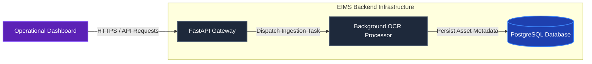
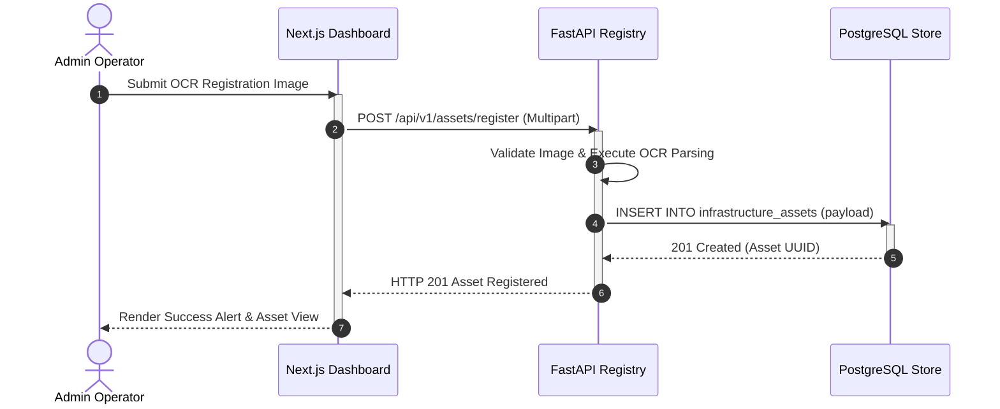
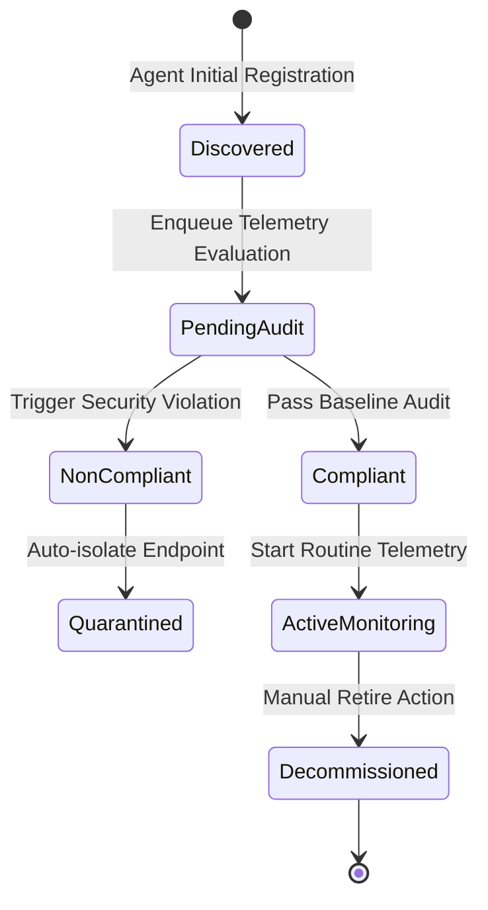

# EIMS Diagram Standard

| Metadata | Value |
| :--- | :--- |
| **Document ID** | EDS-DIAG-001 |
| **Version** | 1.0.0 |
| **Status** | Approved |
| **Owner** | Lead Software Architect |
| **Last Updated** | 2026-08-04 |
| **Review Cycle** | Annual |
| **Related Documents** | [Document Standard](document-standard.md), [Terminology](terminology.md) |

---

## 1. Purpose

This document establishes canonical visual formatting rules, color palette conventions, layout orientation guidelines, and structural design pattern requirements for all architectural diagrams generated across the EIMS project. Applying uniform visual standards ensures rapid structural comprehension and eliminates subjective graphical divergence across documentation artifacts.

---

## 2. Scope

These rules govern all inline graphical diagramming embedded within documentation (`docs/`), architecture blueprints, systems proposals, and runbook manuals. All diagrams must be generated via plain-text syntax using **Mermaid** directly within fenced code blocks (` ```mermaid `). Static raster images exported from external drawing applications are prohibited for architecture maintenance.

---

## 3. General Diagramming Principles

- **Purposeful Visualization:** Generate diagrams solely when they clarify complex topological integrations, concurrent sequencing, state transition logic, or data payload transformations. Never include decorative or trivial diagrams merely to extend document length.
- **Canonical Labeling:** All node labels, system boundaries, and process legends must match canonical terms established in [`_style/terminology.md`](terminology.md).
- **Concise Abstraction:** Keep individual diagrams focused on a single abstraction layer (Context, Container, or Component). Do not collapse database column schemas and global network topologies into one chaotic flowchart.

---

## 4. Visual Styling & Color Palettes

To maintain visual cohesion across light and dark modes rendered by Material for MkDocs, all custom styling must apply our curated enterprise engineering HSL and Hexadecimal structural color palette.

### 4.1 Approved Hex Color Designations

| Node Functional Category | Fill Color | Stroke Color | Text Font Color | Usage Explanation |
| :--- | :--- | :--- | :--- | :--- |
| **Primary System / Service** | `#1E293B` | `#475569` | `#FFFFFF` | Core backend microservices, FastApi APIs, and orchestrator engines. |
| **Asset Registry & Data Stores** | `#1E40AF` | `#3B82F6` | `#FFFFFF` | Persistent storage engines: PostgreSQL databases, MinIO stores, Redis caches. |
| **External Endpoint / Agent** | `#047857` | `#10B981` | `#FFFFFF` | Remote Discovery Agents, target infrastructure hardware, external sensors. |
| **User & UI Application** | `#5B21B6` | `#8B5CF6` | `#FFFFFF` | Next.js Operational Dashboards, administrator Web client interfaces. |
| **Exception / Security Alert** | `#991B1B` | `#EF4444` | `#FFFFFF` | IAM authorization boundaries, compliance violation flags, error sinks. |
| **Async Bus / Telemetry Queue** | `#374151` | `#6B7280` | `#FFFFFF` | Internal event queues, background workers, WebSocket streams. |

### 4.2 Applying Style Classes in Mermaid
Define reusable style classes within flowchart definitions to apply uniform coloring to nodes:


---

## 5. Layout Orientation & Directionality

Select the structural graphing direction based explicitly on the semantic operational nature of the diagrammed interaction:
- **Left-to-Right (`graph LR` or `flowchart LR`)**: Mandatory for sequential data ingestion pipelines, networking request processing flows, OCR asset processing stages, and telemetry streaming architectures.
- **Top-to-Bottom (`graph TB` or `flowchart TB`)**: Mandatory for structural component hierarchies, container deployments, module dependencies, and Work-Breakdown structures.
- **Prohibited Layouts**: Do not mix inverted directions (`RL`, `BT`) or chaotic diagonal routing that induces unnecessary wire crossover artifacts.

---

## 6. Node and Relationship Naming Rules

### 6.1 Node Identifier Formatting
- Node IDs must use PascalCase identifiers without whitespace (e.g., `DiscoveryAgent`, `AssetRegistry`, `PostgreSql`).
- Display labels must be enclosed in explicit geometry brackets matching the architectural element:
  - **Standard Process/Service:** Rectangle brackets `[FastAPI Core]`
  - **Database & Persistent Cache:** Cylinder brackets `[(PostgreSQL Store)]`
  - **Asynchronous Queue / Stream:** Asymmetric trapezoid or stadium brackets `([Telemetry Queue])`

### 6.2 Relational Edge Naming
Every directional edge arrow must include a concise, technical description defining the communication protocol, serialization format, or functional trigger executing across the link. Unlabeled naked arrows (`-->`) are restricted solely to simple internal code flowchart sequencing.
- **Correct Edge Annotation:** `-->|mTLS JSON Payload|` or `-->|SQL Query Exec (Pool)|`
- **Prohibited Edge Annotation:** `-->|data|` or `-->|sends stuff to|`

---

## 7. Approved Diagram Typologies

### 7.1 C4 Architecture Flowcharts (Context & Container Views)
Utilize clear modular grouping subgraphs (`subgraph BoundaryName`) to encapsulate microservices operating within unified trust boundaries, Docker containers, or internal secure Virtual Private Clouds.


### 7.2 Sequence Diagrams
Deploy Mermaid sequence diagrams (`sequenceDiagram`) to document chronological network calls, IAM OAuth/JWT authentication handshakes, and distributed Transaction rollback executions. Ensure explicit activation blocks (`activate/deactivate` or `++ / --`) are applied to indicate active processing threads.


### 7.3 State Machine Diagrams
Use standard state machine models (`stateDiagram-v2`) to formally chart entity lifecycles, such as an Infrastructure Asset transitioning between discovery, audit evaluation, compliance quarantine, and maintenance decommissioning.

