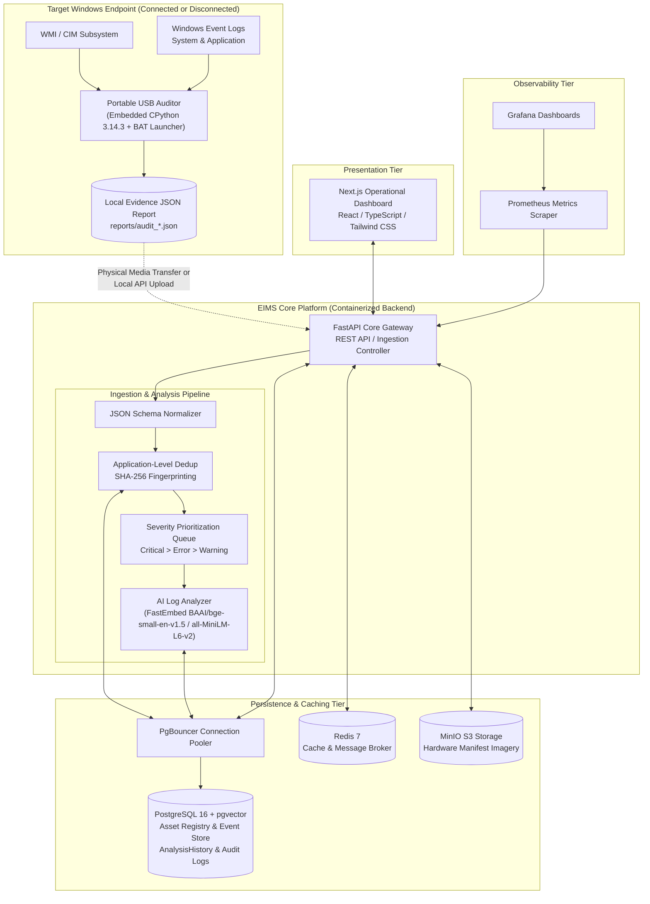
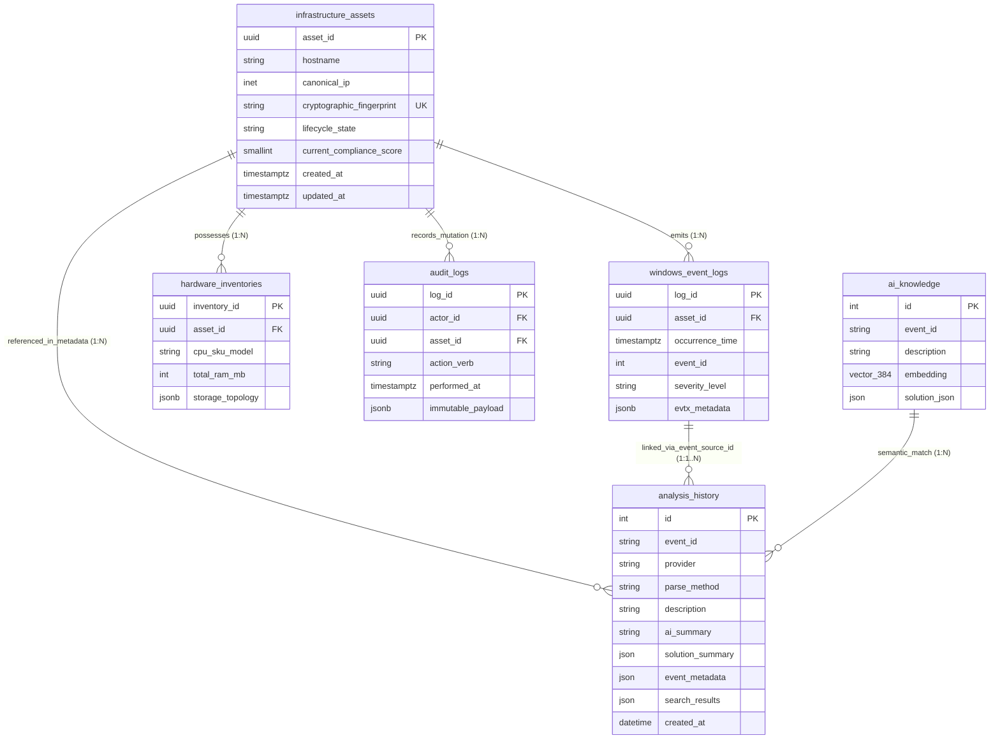
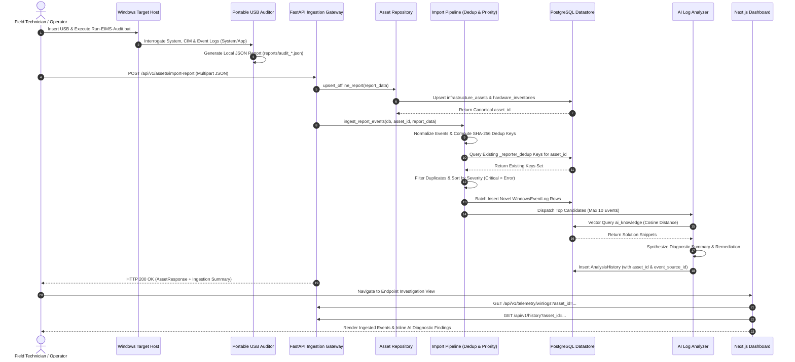

# Chapter 3
# System Design and Implementation

This chapter explains the system requirements, design, and implementation of the Enterprise Infrastructure Management System (EIMS). It details the functional and non-functional requirements, presents the overall system architecture with structural diagrams, specifies the relational and vector data models, documents the portable collection utility, details the ingestion and AI-assisted analysis pipelines, and formalizes the validation and security governance frameworks.

## 3.1 Requirement Analysis

The design of EIMS originated from a formal requirements engineering phase conducted to address enterprise infrastructure visibility and diagnostic bottlenecks. System requirements were formalized within the EIMS Product Requirements Document (EIMS-PRD-001) as canonical architectural specifications.

### 3.1.1 Operational Personas

EIMS defines four distinct operational personas reflecting enterprise organizational boundaries:

1. **System Administrator (Operator):** Oversees enterprise infrastructure availability, registers managed compute endpoints, executes or reviews offline evidence imports, and configures platform settings.
2. **Security & Compliance Auditor:** Inspects endpoint compliance baselines, audits disk encryption postures and antimalware states, and reviews system mutation audit logs.
3. **Hardware Field Technician:** Deploys physical server infrastructure, executes portable USB audits on air-gapped or disconnected machines, and uploads hardware manifest documentation.
4. **Discovery Agent / Collector (Service Account):** Automated execution utility deployed on target endpoints, responsible for gathering system configurations, interrogating operating system events, and structuring JSON evidence payloads.

### 3.1.2 Canonical Architecture & Target Requirements (PRD Baseline)

The platform requirements originated in the Product Requirements Document (EIMS-PRD-001) as long-term architectural specifications and target baselines:

### Canonical Functional Requirements
- **REQ-REG-01 (Canonical Entity Indexing):** The system must assign a universally unique identifier (UUIDv4) to every verified infrastructure asset, persisting canonical properties (hostname, assigned IP address, operating system kernel, lifecycle state) in normalized relational tables.
- **REQ-REG-02 (Telemetry State Deduplication):** Ingestion pipelines must identify existing asset records via composite cryptographic fingerprints (derived from hardware serials and MAC addresses) to execute relational upsert operations, preventing redundant entity creation.
- **REQ-REG-03 (Lifecycle State Machine Enforcement):** The platform must constrain asset state transitions strictly to approved operational lifecycle stages: `Discovered`, `PendingAudit`, `Compliant`, `NonCompliant`, `Quarantined`, and `Decommissioned`.
- **REQ-DISC-01 (Agent Autonomous Enrollment):** Endpoint collectors must register unindexed endpoints by generating a unique cryptographic fingerprint derived from immutable hardware attributes.
- **REQ-DISC-02 (Telemetry Payload Streaming):** Connected agent daemons must collect operating system health metrics and stream validated JSON payloads via HTTPS.
- **REQ-DISC-03 (Asynchronous Queue Buffering):** The API gateway must deserialize incoming payloads, validate structure against domain schemas, and enqueue raw telemetry into in-memory broker queues for asynchronous processing.
- **REQ-DISC-04 (Offline Exception Recovery):** Endpoint collection utilities must support bounded local file buffering when network connectivity to the central platform is unavailable.
- **REQ-LOG-01 (Windows Event Log Ingestion):** The collection pipeline must extract Windows Event Logs, filtering diagnostic noise and streaming operational events to the central platform.
- **REQ-LOG-02 (Anomaly & IoC Rule Evaluation):** Background ingestion engines must evaluate operational event streams to identify operational failures and security exceptions.
- **REQ-LOG-03 (Security Exception Alerting):** Critical operational failures and security exceptions must be recorded within the audit journal and dispatched to administrative interfaces.
- **REQ-COMP-01 (Automated Baseline Evaluation):** The system must compare active endpoint configurations against established baseline rules (antimalware state, firewall enforcement, BitLocker encryption).
- **REQ-COMP-02 (Dynamic Compliance Calculation):** The engine must calculate a composite numeric compliance score ranging from 0 to 100 for every monitored endpoint.
- **REQ-COMP-03 (Automated Quarantine Threshold):** If an asset's computed compliance score drops beneath the acceptable threshold (score < 70), the entity state must transition to `Quarantined`.
- **REQ-OCR-01 (Multipart Manifest Ingestion):** The API gateway must expose dedicated multipart endpoints accepting physical hardware purchase documentation, shipping labels, and specification faceplate imagery.
- **REQ-OCR-02 (Object Storage Archival):** Uploaded binary documents must be archived into local S3-compatible object storage buckets, storing the object URI in relational database tables.
- **REQ-OCR-03 (Autonomous Hardware Parsing):** Asynchronous background workers must extract text strings from stored image binaries to populate hardware inventory records.
- **REQ-UI-01 (Real-Time Observability Portal):** The web interface must render a responsive operational dashboard visualizing asset inventory distributions, compliance scores, active OCR tasks, and operational events.
- **REQ-UI-02 (Live Telemetry Streaming):** Dashboard client sessions must support live metric rendering without requiring manual page reloads.
- **REQ-UI-03 (RBAC Enforcement UI):** The interface must enforce role-based access control, rendering administrative controls for privileged operators while restricting analytical views for read-only auditors.

### 3.1.3 Canonical Non-Functional Requirements
- **NFR-PERF-01 (API Latency):** Synchronous REST API read operations querying the asset registry must achieve response latencies under 50 milliseconds at the 99th percentile (p99) under baseline operational loads.
- **NFR-PERF-02 (Ingestion Throughput):** The combined gateway and caching tier must reliably absorb burst telemetry payloads without queue backpressure.
- **NFR-PERF-03 (OCR Processing Duration):** Asynchronous OCR extraction pipelines must complete text parsing and database commits within bounded operational thresholds.
- **NFR-REL-01 (Database Recovery):** The relational persistence architecture must support rapid database recovery with zero loss of committed transactions (RPO = 0).
- **NFR-REL-02 (Agent Resilience):** Endpoint collection daemons must handle operating system restarts and process crashes gracefully without requiring manual intervention.
- **NFR-SEC-01 (Transport Encryption):** All external network communications spanning agents, web clients, and backend gateways must negotiate modern TLS encryption.
- **NFR-SEC-02 (Audit Log Immutability):** Operational state mutations must be recorded inside an append-only audit log table preventing unauthorized modification or deletion.
- **NFR-SEC-03 (Credential Storage):** Operator passwords and access tokens must undergo one-way cryptographic hashing before relational persistence.
- **NFR-SCALE-01 (Horizontal Stateless Scaling):** Backend ingestion gateways and web interface runners must maintain stateless execution contexts to support containerized scaling.
- **NFR-SCALE-02 (Telemetry Data Retention):** Historical time-series metrics must support chronological table partitioning and long-term archival.

### 3.1.4 Implemented Graduation System Scope

A crucial distinction must be maintained between the initial target specifications in the canonical PRD and the verified implementation delivered for the cooperative education graduation baseline (v0.3.0 with post-release operational hardening):

1. **Streaming Agents vs. Portable Offline Collection:** While the canonical PRD specifies autonomous background discovery daemons continuously streaming telemetry via mTLS/WebSockets (`REQ-DISC-01`, `REQ-DISC-02`), the graduation implementation prioritizes the zero-dependency Portable USB Auditor (`USB_OFFLINE_COLLECTION`). This directly resolves the core enterprise operational constraint where persistent third-party daemons are restricted on mission-critical, air-gapped, or segmented endpoints.
2. **Event Channel Scope:** While the canonical PRD outlines generalized multi-channel event ingestion (`REQ-LOG-01`), the portable graduation workflow intentionally scopes Windows Event Log collection to the `System` and `Application` channels.
3. **Automated Enforcement vs. Non-Destructive Posture:** While the PRD specifies automated quarantine mechanisms that block management APIs (`REQ-COMP-03`), the implemented system calculates dynamic compliance scores and reflects quarantined states visually on the dashboard, strictly preserving a non-destructive, read-only operational posture.
4. **Infrastructure Architecture vs. Distributed Clustering:** While the PRD non-functional requirements define horizontal Kubernetes scaling (`NFR-SCALE-01`), sub-30-second automated database failover (`NFR-REL-01`), and sustained 5,000 req/sec ingestion (`NFR-PERF-02`), the graduation prototype is deployed via single-node container services using Docker Compose with PgBouncer connection pooling. Distributed clustering, Redis Sentinel, and Kubernetes orchestration remain post-graduation architectural roadmaps.
5. **Sequential Deduplication & Bounded AI Workload:** The graduation release introduces application-level sequential deduplication and bounds AI triage to a maximum of 10 prioritized events per batch import, ensuring predictable resource consumption on single-node deployments.

## 3.2 Overall System Architecture

EIMS is implemented as a **Hybrid Modular Monolith paired with an Asynchronous Ingestion Pipeline**. This architectural style was chosen over a distributed microservices pattern to eliminate unnecessary network serialization latency, reduce inter-service failure domains, and maintain transactional database integrity within a cohesive codebase, while isolating high-throughput ingestion workflows via asynchronous messaging.

### Major Architectural Components

1. **Target Windows Endpoints:** Physical servers, virtual machines, or workstations running supported Windows operating systems.
2. **Portable USB Auditor:** A zero-dependency, self-contained auditing package featuring an embedded CPython 3.14.3 amd64 runtime, executed on target endpoints via batch scripts to generate local JSON reports.
3. **FastAPI Core Gateway:** High-performance asynchronous Python backend providing RESTful API endpoints, Pydantic request validation, business logic orchestration, and OpenAPI contract publication.
4. **PostgreSQL Relational Datastore:** Primary persistent ACID datastore equipped with the `pgvector` extension for semantic vector similarity search and `JSONB` binary structures for polymorphic telemetry.
5. **Redis Cache & Event Broker:** In-memory key-value data store used for transient message queuing, rate limiting, and caching computationally intensive query aggregates.
6. **PgBouncer Connection Pooler:** Lightweight connection pooler managing PostgreSQL connection lifecycle, mitigating database thread exhaustion under high connection concurrency.
7. **MinIO Object Storage:** S3-compatible local object storage storing binary files, including hardware sticker images and shipping documentation.
8. **AI Log Analyzer:** Semantic retrieval and diagnostic triage service utilizing FastEmbed (`BAAI/bge-small-en-v1.5` primary, with SentenceTransformer `all-MiniLM-L6-v2` fallback) and pgvector cosine distance matching to generate contextual mitigation advice.
9. **Next.js Operational Dashboard:** Responsive web application built with React and TypeScript, providing interactive interfaces for asset management, event investigation, global search, and timeline visualization.
10. **Observability Stack:** Prometheus metrics scraper and Grafana visualization engine monitoring host and application telemetry via standardized health probe endpoints.

### System Architecture Diagram



## 3.3 Asset Registry and Data Model

The EIMS persistent data model balances normalized relational entities with semi-structured JSONB columns.

### Core Relational Entities

1. **`infrastructure_assets`:** The central entity representing a registered compute endpoint.
   - `asset_id` (UUIDv4, Primary Key): Canonical asset identifier.
   - `hostname` (VARCHAR): Operating system networking hostname.
   - `canonical_ip` (INET): Primary network IP address.
   - `cryptographic_fingerprint` (VARCHAR, Unique): SHA-256 hash of immutable hardware serials and MAC addresses.
   - `lifecycle_state` (VARCHAR): State machine indicator (`Discovered`, `Compliant`, `NonCompliant`, `Quarantined`, `Decommissioned`).
   - `current_compliance_score` (SMALLINT): Integer score (0–100) reflecting security posture compliance.
   - `created_at`, `updated_at` (TIMESTAMPTZ): Temporal tracking timestamps.
2. **`windows_event_logs`:** Persists extracted Windows operating system events.
   - `log_id` (UUIDv4, Primary Key): Unique log processing identifier.
   - `asset_id` (UUIDv4, Foreign Key): Reference binding the log to `infrastructure_assets.asset_id` (`ON DELETE CASCADE`).
   - `occurrence_time` (TIMESTAMPTZ): Origin timestamp recorded by the Windows operating system kernel.
   - `event_id` (INTEGER): Canonical Windows numeric event code.
   - `severity_level` (VARCHAR): Severity classification (`Critical`, `Error`, `Warning`, `Information`).
   - `evtx_metadata` (JSONB): Structured dictionary containing the event provider, channel, record identifier, message text, and cryptographic deduplication hash (`_reporter_dedup`).
3. **`analysis_history`:** Stores diagnostic findings, vector search matches, and mitigation plans generated by the AI Analyzer.
   - `id` (INTEGER, Primary Key): Monotonically increasing record ID.
   - `event_id` (VARCHAR): Windows event identifier analyzed.
   - `provider` (VARCHAR): Originating event provider.
   - `parse_method` (VARCHAR): Source provenance classification string (`USB_OFFLINE_COLLECTION:USB_OFFLINE_COLLECTION`).
   - `description` (VARCHAR): Normalized event textual description.
   - `ai_summary` (VARCHAR): Synthesized diagnostic explanation and remediation plan.
   - `solution_summary` (JSON): Structured mitigation parameters and reference links.
   - `event_metadata` (JSON): Provenance envelope binding the finding to `asset_id`, `event_source_id`, channel, and deduplication keys.
   - `search_results` (JSON): Matched knowledge base records and similarity metrics.
   - `created_at` (DATETIME): Ingestion and analysis timestamp.
4. **`ai_knowledge`:** Vector knowledge base containing curated diagnostic resolutions.
   - `id` (INTEGER, Primary Key): Unique knowledge entry ID.
   - `event_id` (VARCHAR): Associated Windows event identifier.
   - `description` (VARCHAR): Technical failure description.
   - `embedding` (VECTOR(384)): Dense vector embedding (384 dimensions) generated via FastEmbed `BAAI/bge-small-en-v1.5` (with SentenceTransformer `all-MiniLM-L6-v2` fallback).
   - `solution_json` (JSON): Recommended administrative mitigation procedures.
5. **`hardware_inventories`:** Catalogs deep physical hardware configurations linked to an asset.
   - `inventory_id` (UUIDv4, Primary Key): Inventory snapshot identifier.
   - `asset_id` (UUIDv4, Foreign Key): Linked asset entity.
   - `cpu_sku_model` (VARCHAR): Microprocessor vendor and model name.
   - `total_ram_mb` (INTEGER): Total physical memory capacity.
   - `storage_topology` (JSONB): Attached physical disks, controller types, and partition volumes.
6. **`audit_logs`:** Tamper-evident operational audit journal.
   - `log_id` (UUIDv4, Primary Key): Transaction identifier.
   - `actor_id` (UUIDv4, Nullable): Operating user or service account.
   - `asset_id` (UUIDv4, Nullable): Target asset affected.
   - `action_verb` (VARCHAR): Operational action executed.
   - `performed_at` (TIMESTAMPTZ): UTC execution timestamp.
   - `immutable_payload` (JSONB): State snapshot before and after mutation.

### Entity Relationship Diagram



## 3.4 Portable USB Auditor Design

The Portable USB Auditor (`clients/usb_auditor/`) is a standalone auditing utility designed to execute on isolated Windows endpoints.

### Core Architectural Decisions

- **Self-Contained CPython Runtime:** The package incorporates an embedded, portable CPython 3.14.3 amd64 interpreter (downloaded as `python-3.14.3-embed-amd64.zip` during packaging). The target host requires no preinstalled Python, pip, Git, Docker, or external runtimes.
- **Batch Launcher (`Run-EIMS-Audit.bat`):** Field technicians execute audits simply by double-clicking the batch script. The launcher establishes relative working paths, executes runtime integrity preflights, and invokes the Python scanning engine.
- **Local Evidence Artifacts:** In portable execution mode, the configuration variable `EIMS_AUTO_SYNC` defaults to `false`. The scanning engine structures all collected telemetry into a structured JSON report written directly to the removable drive at `reports/audit_<hostname>_<timestamp>.json`.
- **Package Integrity Verification:** The package includes a cryptographic manifest (`manifest.sha256`) containing SHA-256 hashes of all internal audit scripts and dependencies. The launcher verifies manifest integrity prior to execution to detect media corruption or file tampering.
- **Strict Read-Only Posture:** Runs from a USB drive with a bundled runtime; uses read-only queries and writes its output to configured report/log directories. No persistent agent installation is required.
- **BitLocker Secret Exclusion Boundary:** The scanner interrogates BitLocker drive encryption via CIM, recording posture attributes (`protection_status`, `volume_status`, `encryption_percentage`, `encryption_method`, `recovery_protector_present`, and `recovery_protector_count`). The collection script strictly excludes recovery keys; parameters such as `RecoveryPassword`, `recovery_key`, and plaintext protector secrets are never extracted or stored. A case-insensitive secret stripping function cleans all memory structures prior to report generation.

### Builder Safety Controls

The USB Auditor packaging tool (`tools/build_usb_package.py`) incorporates stringent drive safety checks:
- The builder requires explicit, manual selection of a verified removable drive letter.
- It executes no automatic formatting and no disk repartitioning commands.
- It validates filesystem permissions and verifies available drive capacity prior to copying the runtime bundle.

## 3.5 Endpoint Evidence Collection

The USB Auditor scanning engine gathers evidence across seven operational categories:

1. **System & OS Information:** Hostname, domain/workgroup, Windows edition, kernel build, install date, and system uptime.
2. **Hardware Configuration:** CPU architecture, core count, physical RAM modules, motherboard serial number, BIOS version, and physical storage drives.
3. **Network Configurations:** Active network adapters, MAC addresses, IPv4/IPv6 addresses, subnet masks, default gateways, and DNS servers.
4. **Security & Hardening Posture:** Windows Defender antimalware status and definition age, Windows Firewall profile enforcement (Domain, Private, Public), Windows Update service status, and BitLocker encryption posture.
5. **Running Services:** Windows services inventory, highlighting critical infrastructure daemons.
6. **Compliance Scoring:** Local evaluation of baseline hardening metrics yielding a local preliminary compliance score (0–100).
7. **Windows Event Log Evidence:** Scoped extraction of operational event logs.

### Event Collection Constraints

To balance diagnostic visibility with storage and performance constraints:
- **Channels:** The portable graduation workflow intentionally scopes Windows Event Log collection to the `System` and `Application` channels, focusing diagnostic evidence acquisition directly on core operating system reliability, hardware health, and enterprise software execution.
- **Temporal Window:** Defaults to the preceding 24 hours of operational history.
- **Record Threshold:** Default maximum of 500 events across the combined query (`-MaxEvents 500` across System and Application, filtering Critical, Error, and Warning events), preventing memory exhaustion on unstable hosts experiencing severe log flooding.

## 3.6 Offline Report Schema and Ingestion

Ingestion of offline evidence into the centralized platform is handled via the canonical API endpoint:

```http
POST /api/v1/assets/import-report
```

The endpoint accepts a multipart form upload containing the raw JSON report emitted by the USB Auditor.

### End-to-End Ingestion Flow

1. **Payload Reception & Deserialization:** The endpoint receives the multipart file stream, deserializes the JSON content, and validates schema conformance using Pydantic models.
2. **Asset Entity Upsert:** The repository extracts the asset's cryptographic fingerprint (or networking hostname) and performs a PostgreSQL relational upsert:
   - If the asset exists, its hardware inventory, network configuration, and compliance score are updated.
   - If the asset is novel, a new `infrastructure_assets` entity is created with state `Compliant` (if score >= 70) or `NonCompliant`.
3. **Event Normalization:** The pipeline extracts the `event_logs` array. Individual events are validated for structural integrity, mapping fields to canonical schema parameters (`event_id`, `severity_level`, `occurrence_time`, `channel`, `provider`, `record_id`, `message`).
4. **Sequential Deduplication:** The service computes SHA-256 deduplication keys for each normalized event and queries existing records in PostgreSQL to eliminate duplicate entries.
5. **Batch Persistence:** Novel, non-duplicate events are inserted into `windows_event_logs` within an atomic database transaction.
6. **Severity Prioritization:** Novel events are routed into a priority ranking queue, sorting records by severity (`Critical > Error > Warning > Information`).
7. **Bounded AI Analysis:** The top candidates (strictly bounded to a maximum of 10 events) are dispatched to the AI Analyzer service.
8. **Analysis History Persistence:** Generated diagnostic summaries and mitigation recommendations are committed to `analysis_history` with complete asset and event provenance.

### Offline Evidence Ingestion Sequence



## 3.7 Sequential Deduplication Design

To prevent duplicate operational records during recurring offline audits, EIMS implements an application-level cryptographic deduplication mechanism.

### Deduplication Key Derivation

For each incoming event, the pipeline computes a deterministic SHA-256 hash across five immutable operational attributes:

DedupKey = SHA-256(asset_id | channel | provider | record_id | occurrence_time)

This composite key is stored within the event's `evtx_metadata` JSONB column under the key `_reporter_dedup`.

### Query Evaluation and Filtering

During ingestion, the service extracts all deduplication keys from the incoming payload and queries PostgreSQL:

```sql
SELECT evtx_metadata->>'_reporter_dedup'
FROM windows_event_logs
WHERE asset_id = :asset_id
  AND evtx_metadata->>'_reporter_dedup' IN (:keys);
```

Matching keys returned by the query are classified as duplicate events and skipped. Only novel keys proceed to database insertion.

### Architectural Limitation and Concurrency Boundary

It is vital to state the architectural boundary of this implementation: **deduplication is enforced at the application level during sequential processing**. It is not enforced by a PostgreSQL table-level `UNIQUE` constraint across the JSONB path. Consequently, while this mechanism reliably prevents duplicate record insertion during normal sequential report imports, concurrent parallel uploads of identical reports across multiple threads could experience race conditions. Deduplication is enforced at the application level during sequential processing. Database-level unique constraints and concurrency control across concurrent imports remain future work.

## 3.8 Event Prioritization

To prevent analytical resource exhaustion and focus operator attention on critical system failures, the ingestion pipeline implements deterministic severity prioritization:

1. **Priority Stratification:** Events are assigned numerical priority ranks based on normalized severity strings:
   - `Critical` $\rightarrow$ Priority 3
   - `Error` $\rightarrow$ Priority 2
   - `Warning` $\rightarrow$ Priority 1
   - `Information` $\rightarrow$ Priority 0
2. **Stable Sorting:** Candidate events are sorted in descending order of priority. To ensure reproducible behavior, identical priority tiers preserve their original incoming sequence.
3. **Analytical Workload Cap:** The implementation enforces a strict upper bound of at most 10 newly ingested events analyzed per import run.
4. **Duplicate Analysis Prevention:** The pipeline queries `analysis_history` to verify whether candidate deduplication keys have previously undergone analysis, skipping already-analyzed events.

## 3.9 AI-assisted Analyzer Integration

The EIMS AI Analyzer (`backend/domain/analyzer/`) provides contextual diagnostic assistance for prioritized operational failures.

### Semantic Retrieval Pipeline

1. **Event Parsing:** The analyzer constructs a normalized event description combining Event ID, Provider name, Channel, and extracted message content.
2. **Local Vector Embedding:** The system generates a 384-dimensional vector embedding using FastEmbed (primary model `BAAI/bge-small-en-v1.5`, with SentenceTransformer `all-MiniLM-L6-v2` fallback). Analysis evaluates curated answers first, then retrieval from `ai_knowledge`, optional Gemini synthesis when configured, retrieved answers, and web-derived fallback.
3. **pgvector Similarity Query:** The embedding is queried against the `ai_knowledge` table using PostgreSQL's cosine distance operator (`<=>`):
   ```sql
   SELECT id, event_id, description, solution_json, (embedding <=> :query_vector) AS distance
   FROM ai_knowledge
   ORDER BY distance ASC
   LIMIT 3;
   ```
4. **Synthesis of Mitigation Advice:** The retrieved solution snippets, combined with curated catalog heuristics, are processed by the diagnostic synthesis service, producing structured mitigation advice, relevant Microsoft documentation links, and diagnostic confidence scores.
5. **Non-Fatal Error Isolation:** The entire analytical pipeline is wrapped in non-fatal exception handling. If embedding generation or synthesis encounters an error (such as a timeout or database contention), the failure is logged, but the parent transaction safely commits the persisted `windows_event_logs` records. Committed event rows are retained when a later analysis attempt fails.

## 3.10 Analysis Provenance

Every finding generated by the AI Analyzer records explicit audit provenance within the `analysis_history.event_metadata` JSON column:

```json
{
  "source_type": "USB_OFFLINE_COLLECTION",
  "source_subtype": "WINDOWS_EVENT_LOG",
  "asset_id": "00000000-0000-0000-0000-000000000000",
  "event_source_id": "11111111-1111-1111-1111-111111111111",
  "channel": "System",
  "provider": "Service Control Manager",
  "record_id": 14205,
  "occurrence_time": "2026-09-28T08:14:22.000Z",
  "_reporter_dedup": "e3b0c44298fc1c149afbf4c8996fb92427ae41e4649b934ca495991b7852b855"
}
```

- `source_type`: Identifies the collection methodology (`USB_OFFLINE_COLLECTION`).
- `asset_id`: Formally links the analysis record to the parent infrastructure asset.
- `event_source_id`: Establishes a JSON-embedded foreign reference pointing to the specific `windows_event_logs.log_id` record that triggered the analysis.
- `parse_method`: Recorded as `USB_OFFLINE_COLLECTION:USB_OFFLINE_COLLECTION` in the table's classification column.

Because `analysis_history` was designed to accommodate polymorphic analysis types across both operational event streams and ad-hoc queries, `event_source_id` is maintained as a structured attribute within `event_metadata` rather than a rigid relational SQL foreign key constraint. This design preserves complete audit traceability back to originating event log entries while maintaining schema flexibility.

## 3.11 Backend API Design

The FastAPI backend exposes standardized, RESTful HTTP interfaces conforming to OpenAPI 3.1 specifications.

### Core Interface Endpoints

- **`POST /api/v1/assets/import-report`:** Canonical ingestion endpoint accepting multipart JSON reports. Returns an `AssetResponse` containing the updated asset entity and an `event_ingestion` summary object.
- **`GET /api/v1/assets`:** Retrieves paginated lists of registered infrastructure assets, supporting filters by hostname, lifecycle state, and compliance score threshold.
- **`GET /api/v1/assets/{asset_id}`:** Returns deep asset details, including linked hardware inventories and active security configurations.
- **`GET /api/v1/telemetry/winlogs`:** Queries ingested Windows Event Log records, accepting query parameters for `asset_id`, `event_id`, `severity`, and ISO-8601 temporal bounds (`from`, `to`).
- **`GET /api/v1/history`:** Retrieves historical AI analysis records, supporting asset-scoped filtering via the `asset_id` query parameter (`GET /api/v1/history?asset_id=...`).
- **`GET /api/v1/search`:** Executes multi-domain search across assets, event logs, and audit records, supporting global keyboard navigation.
- **`GET /api/v1/timeline`:** Returns a unified chronological timeline aggregating audit logs, telemetry metrics, and Windows event logs.
- **`GET /api/v1/health`:** Evaluates backend health and verifies active connectivity to PostgreSQL, Redis, and MinIO datastores.

### Error Handling Architecture

The backend architecture establishes an RFC 7807 Problem Details exception framework (`application/problem+json`) for schema validation failures (`RequestValidationError`) and domain exceptions (`EIMSProblemException`), while standard endpoint HTTP status exceptions return structured detail payloads. When validation or domain exceptions occur, the gateway renders structured JSON envelopes:

```json
{
  "type": "https://eims.internal/errors/invalid-report",
  "title": "Invalid Offline Report Format",
  "status": 400,
  "detail": "Failed to parse offline report: missing required cryptographic fingerprint.",
  "instance": "/api/v1/assets/import-report",
  "tracking_uuid": "c3b8a1f4-9b2e-4d5a-8f1e-2a3b4c5d6e7f"
}
```

## 3.12 Investigation Dashboard

The frontend interface (`clients/dashboard/`) is developed with Next.js, React, and TypeScript, styled using Tailwind CSS design tokens.

### Interface Views

1. **Endpoints Management View (`/endpoints`):** Presents a comprehensive data table of all registered infrastructure assets, displaying real-time compliance badges, operating system versions, and quick-filter toggles.
2. **Asset Inspection Detail View (`/endpoints/[id]`):** Deep diagnostic portal displaying:
   - System specification cards (CPU SKU, memory capacity, storage layout).
   - Network interface bindings and canonical IP assignments.
   - Security and compliance posture meters (BitLocker encryption status, Windows Defender recency, Firewall enforcement).
   - Event Evidence Table: Interactive event viewer rendering ingested `System` and `Application` logs with severity badges, channel filters, and record timestamps.
   - Inline AI Findings: Dynamic panel rendering synthesized diagnostic findings, root-cause explanations, and mitigation action checklists corresponding to the specific asset.
3. **Global Search Palette (`Ctrl+K`):** Keyboard-driven search interface querying assets, hostnames, IP addresses, and event identifiers across nine registered search providers .
4. **Unified Operational Timeline (`/timeline`):** Synchronized chronological stream correlating configuration changes, telemetry spikes, and critical event failures.

*Note: Formal browser runtime verification and UI rendering validation results are presented in Chapter 4.*

## 3.13 Authentication and Security Design

EIMS enforces strict security and authentication boundaries across all interfaces.

### Dual Authentication Modes

The backend platform supports two operational authentication modes configured via the `EIMS_AUTH_MODE` environment variable:
- **`demo` Mode:** Used for local development, rapid evaluation, and automated end-to-end testing in isolated environments. The authentication dependency (`get_current_user`) bypasses token validation and returns a standardized `demo` identity with administrative access.
- **`secure` Mode:** Enforces mandatory cryptographic token verification. Incoming requests must carry a valid HTTP `Authorization: Bearer <JWT>` header signed with a shared secret using the HS256 algorithm. Requests lacking valid tokens are rejected with HTTP 401 Unauthorized errors.

### Removal of Privileged Static Tokens

In early development iterations, client-side administrative pages utilized a hardcoded administrative token (`EIMS-ADMIN-TOKEN`). During security hardening, this vulnerability was eliminated:
- All privileged static tokens were completely removed from frontend TypeScript source files.
- Administrative write operations (such as manual asset state changes) are protected on the backend using the `verify_admin_token` / `require_admin_for_write` dependency, ensuring that privileged actions require authenticated server-side sessions.

### Trusted Local Sandbox Limitation

In the current cooperative education release, `demo` mode operates under the explicit architectural assumption of a trusted local execution boundary. Deploying the system in untrusted or multi-tenant production networks requires activating `secure` mode and provisioning dedicated API gateway credentials.

## 3.14 Observability and Supporting Infrastructure

The containerized infrastructure architecture is orchestrated via Docker Compose, incorporating:
- **PostgreSQL 16:** Configured with relational write-ahead logging (WAL) and the `pgvector` extension.
- **PgBouncer:** Configured in transaction pooling mode to manage backend database connections efficiently.
- **Redis 7:** Running Alpine Linux containers configured with volatile-lru eviction policies.
- **MinIO:** S3-compliant object store hosting unstructured hardware documentation imagery.
- **Prometheus & Grafana:** Continuous metrics scraping infrastructure polling backend `/metrics` endpoints.

## 3.15 Development and Validation Methodology

Platform reliability and architectural compliance were validated through a structured, multi-tier testing methodology:

1. **Automated Unit Testing:** Unit test suites (executed via `pytest`) validating pure helper functions, deduplication key derivation, event normalization, priority queue sorting, and case-insensitive BitLocker secret stripping.
2. **Integration Testing:** API integration tests executing against isolated FastAPI test clients, asserting HTTP status codes, schema validation, and error envelopes.
3. **Live PostgreSQL Persistence Validation:** Database integration suites executing against live PostgreSQL container instances, validating JSONB containment operators (`->>`, `@>`) and pgvector cosine similarity syntax.
4. **Frontend Static Typing & Production Build:** Comprehensive TypeScript compilation checks (`npx tsc --noEmit`) and Next.js production bundle compilation (`npm run build`), asserting zero type errors and zero broken imports.
5. **USB Packager Preflight Validation:** Verification of the USB Auditor packaging script, asserting removable drive preflight safety, file copy completeness, and SHA-256 manifest generation.
6. **Field Endpoint Validation:** Execution of the portable auditor on physical and virtual Windows test workstations, asserting zero runtime crashes and valid report generation.
7. **Production-Representative Windows Server Validation:** Execution of the auditor on an authorized enterprise Windows Server host, capturing real-world operational event logs.
8. **Sequential Duplicate Ingestion Validation:** Verification of the ingestion pipeline by executing sequential re-imports of identical field reports, asserting that duplicate events are filtered without error.
9. **Live API and Browser UI Verification:** Verification of live API endpoints (`GET /api/v1/telemetry/winlogs` and `GET /api/v1/history?asset_id=...`) and interactive verification of the web dashboard rendering event evidence and AI findings without error.

*Note: Measured test execution values, pass rates, and empirical field results are presented in Chapter 4.*

## 3.16 Data Protection and Evidence Handling

To ensure compliance with corporate confidentiality agreements and academic integrity standards, EIMS enforces strict data protection rules:

- **Public Repository Confidentiality Policy:** No proprietary enterprise data, customer identifiers, real IP addresses, MAC addresses, hardware serial numbers, user account names, internal domain names, or raw system logs may be committed to public version control repositories.
- **Strict Anonymization of Academic Artifacts:** In all academic documentation, reports, and presentation materials, real enterprise infrastructure entities are replaced with standardized aliases (e.g., `ASSET-01`, `Endpoint A`, `Windows Server A`).
- **BitLocker Secret Exclusion:** The collection utilities and ingestion parsers strictly prohibit the acquisition, transmission, or persistence of BitLocker Recovery Keys or plaintext passwords.
- **Physical Separation of Evidence:** Raw, unredacted field audit reports and full-resolution unredacted screenshots are archived in secure, local private storage directories outside the Git repository. Only sanitized, anonymized artifacts are referenced within project documentation.

## 3.17 Design Limitations

To maintain academic and professional honesty, the architectural boundaries and known limitations of EIMS are explicitly documented:

- **Windows-First Scope:** The current implementation of the portable collector and event ingestion pipeline is specialized for the Microsoft Windows operating system ecosystem. Cross-platform support for Linux distributions or macOS endpoints is deferred to future work.
- **Manual Physical Transport (Sneaker-Net):** In air-gapped environments, transferring the offline JSON evidence report from the target machine to the centralized EIMS platform requires manual physical transport of the USB drive by an operator.
- **Application-Level Sequential Deduplication:** Event deduplication is enforced at the application level during sequential processing. Simultaneous parallel imports of identical reports across concurrent threads could experience race conditions due to the absence of database-level unique constraints on JSONB fields.
- **Bounded AI Workload:** The AI Analyzer processes at most 10 prioritized events per batch import. While this safeguards system stability and controls computational latency, events outside the selected subset are not automatically analyzed by re-importing the same report; a separate review or reanalysis workflow would be future work.
- **Non-Destructive Read-Only Operation:** EIMS deliberately omits automated host remediation capabilities. The system identifies failures and suggests mitigation procedures, but does not execute automated configuration changes on monitored endpoints.
- **Operational Triage vs. Certified Forensics:** EIMS is designed as an infrastructure management and operational triage aid. It is not certified as a court-admissible digital forensics acquisition platform.
- **AI as Assistive Triage:** AI-generated diagnostic explanations and remediation plans represent probabilistic recommendations derived from semantic vector matching; they do not constitute infallible or legally binding root-cause guarantees.
- **Prototype Deployment Architecture:** The current graduation release is deployed via single-instance containers orchestrated with Docker Compose; it does not implement enterprise high-availability clustering, distributed multi-region failover, or enterprise Single Sign-On (SSO) federation.

## 3.18 Chapter Summary

This chapter detailed the comprehensive system design and implementation of the Enterprise Infrastructure Management System (EIMS). The discussion formalized functional and non-functional requirements, mapped operational personas, distinguished the canonical PRD baseline from the implemented graduation scope, articulated the hybrid modular monolith architecture with complete component and sequence diagrams, and detailed the persistent relational and vector data models. Furthermore, the self-contained portable USB Auditor, the offline ingestion pipeline, application-level sequential deduplication, severity prioritization, and RAG-based AI analysis were thoroughly analyzed. Finally, the Next.js web dashboard, authentication boundaries, multi-tier validation methodology, and data protection policies were documented, concluding with an honest appraisal of system design limitations. With the system design and implementation established, Chapter 4 presents the empirical validation results, test execution metrics, and real-world field verification evidence.
